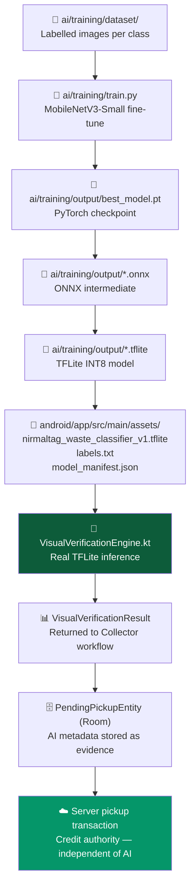

# NirmalTag AI Model Pipeline

**Version:** 1.0  
**Status:** INFRASTRUCTURE READY — Model Training Blocked (Insufficient Dataset)

---

## 1. Overview

This document describes the complete pipeline for creating, training, exporting, and deploying the NirmalTag On-Device Waste Visual Classifier — from raw dataset images to an installed TFLite asset in the Android APK.



---

## 2. Architecture

### Model: MobileNetV3-Small

| Property | Value |
| :--- | :--- |
| Base architecture | MobileNetV3-Small (depthwise separable convolutions) |
| Pretrained weights | ImageNet1K V1 |
| Fine-tuning | Replace final classifier head → 5 NirmalTag classes |
| Input | 224 × 224 × 3 (RGB, float32) |
| Normalization | ImageNet mean/std: `[0.485, 0.456, 0.406]` / `[0.229, 0.224, 0.225]` |
| Output | 5-element logit vector → softmax probabilities |
| Export | ONNX opset 11 → TensorFlow Lite INT8 quantized |
| Target device | Android 10+ (ARM64) |

### Why MobileNetV3-Small?

- **~3.5M parameters** — small APK footprint
- **< 500ms inference on mid-range ARM CPUs** (OPPO A15s / Snapdragon 439)
- Optimized for mobile via XNNPACK delegate
- Well-supported by TFLite runtime 2.14+
- INT8 quantization reduces model size ~4× vs float32

---

## 3. Step-by-Step Pipeline

### Step 1: Collect Dataset

Follow `docs/AI_DATASET_SPECIFICATION.md`:
- Minimum 50 images per class (250 total)
- Recommended 300+ per class for production quality
- Strip EXIF metadata (GPS, device info) before committing

```bash
# Strip EXIF from all dataset images (install piexif first)
pip install piexif Pillow
python ai/training/strip_exif.py ai/training/dataset/
```

### Step 2: Train

```bash
pip install torch torchvision scikit-learn tqdm onnx
# GPU (faster, recommended if available):
python ai/training/train.py --dataset ai/training/dataset --epochs 50 --seed 42 --device cuda
# CPU (slower, works on any machine):
python ai/training/train.py --dataset ai/training/dataset --epochs 30 --seed 42 --device cpu
```

**Outputs:**
- `ai/training/output/best_model.pt` — best validation checkpoint
- `ai/training/output/training_history.json` — epoch-by-epoch metrics
- `ai/training/output/evaluation_report.json` — test-set metrics (accuracy, F1, confusion matrix)

**Stop condition:** If dataset minimum not met, training prints `TRAINING BLOCKED` and exits with code 2.

### Step 3: Export to TFLite

```bash
pip install tensorflow onnx-tf
python ai/training/export_tflite.py --checkpoint ai/training/output/best_model.pt
```

**Outputs:**
- `ai/training/output/nirmaltag_waste_classifier_v1.onnx` — ONNX intermediate
- `ai/training/output/nirmaltag_waste_classifier_v1.tflite` — INT8 TFLite model
- `android/app/src/main/assets/nirmaltag_waste_classifier_v1.tflite` ← installed to APK
- `android/app/src/main/assets/labels.txt` ← class names (0-indexed)
- `android/app/src/main/assets/model_manifest.json` ← SHA-256 and metadata

### Step 4: Validate

```bash
pip install tflite-runtime scikit-learn
python ai/training/validate.py \
  --model android/app/src/main/assets/nirmaltag_waste_classifier_v1.tflite \
  --labels android/app/src/main/assets/labels.txt \
  --dataset ai/training/dataset
```

**Reports:** Per-class precision, recall, F1, confusion matrix, and production-readiness verdict.

### Step 5: Build Android APK

```bash
cd android
.\gradlew.bat assembleRelease
```

The model is bundled in the APK via `aaptOptions { noCompress += "tflite" }` in `build.gradle.kts`.

### Step 6: Rebuild if Model Updates

Every time the model is retrained:
1. Re-run `train.py` → new `best_model.pt`
2. Re-run `export_tflite.py` → new `.tflite` in assets
3. **Update `MODEL_VERSION`** in both `train.py` and `VisualVerificationEngine.kt`
4. Re-run `.\gradlew.bat assembleRelease`
5. Record new SHA-256 in `docs/ITERATION_21_AI_CLASSIFIER_IMPLEMENTATION.md`

---

## 4. Android Integration

### VisualVerificationEngine.kt

Located: [`android/app/src/main/java/com/nirmaltag/app/ai/VisualVerificationEngine.kt`](file:///d:/LOQ/Documents/WasteChakra/android/app/src/main/java/com/nirmaltag/app/ai/VisualVerificationEngine.kt)

**Responsibilities:**
1. Load TFLite model from `assets/` using `FileUtil.loadMappedFile()`
2. Validate model asset presence via `isModelAssetPresent()`
3. Load class labels from `labels.txt`
4. Preprocess bitmap: resize → normalize → pack into `ByteBuffer` (float32, NCHW→NHWC)
5. Run `Interpreter.run()` on evidence image
6. Apply softmax to logit output
7. Determine predicted class and confidence
8. Apply confidence threshold (0.80)
9. Return structured `VisualVerificationResult`
10. Release interpreter resources via `close()`

**Failure states** (safe fallback, never crashes):

| Status | Meaning |
| :--- | :--- |
| `MODEL_UNAVAILABLE` | `.tflite` asset not found in APK |
| `MODEL_LOAD_FAILED` | Asset present but TFLite interpreter could not initialize |
| `INVALID_IMAGE` | Null or zero-dimension bitmap supplied |
| `INFERENCE_FAILED` | Runtime exception during `interpreter.run()` |
| `LOW_CONFIDENCE` | Inference succeeded but confidence < 0.80 |
| `CLASSIFIED` | Full success — result is usable as evidence |

### Room Integration

AI metadata stored in [`PendingPickupEntity`](file:///d:/LOQ/Documents/WasteChakra/android/app/src/main/java/com/nirmaltag/app/data/local/PendingPickupEntity.kt):

```kotlin
val aiStatus: String,      // Status enum name
val aiConfidence: Float,   // 0.0f if MODEL_UNAVAILABLE
val aiInferenceMs: Long    // Wall-clock inference time
```

### WorkManager

AI inference executes **before** enqueueing to `PickupSyncWorker`:
1. Capture still image
2. Run `evaluateEvidenceImage(bitmap)` → `VisualVerificationResult`
3. Store result in `PendingPickupEntity`
4. Enqueue entity to Room
5. `PickupSyncWorker` picks up entity → syncs to server (no AI dependency)

Server pickup RPC is authoritative — AI result is advisory evidence only.

---

## 5. Model Versioning

| Version | File | Architecture | Status |
| :--- | :--- | :--- | :--- |
| `nirmaltag-v1` | `nirmaltag_waste_classifier_v1.tflite` | MobileNetV3-Small INT8 | Pending (awaits dataset) |

When training produces a new model, increment to `nirmaltag-v2`, `nirmaltag-v3`, etc.
Never silently replace a model artifact without changing the version string.

---

## 6. Security

- The `.tflite` file is **not a secret** — it may be inspected by reverse-engineering tools.
- No credentials, API keys, or private data should ever be embedded in the model or metadata.
- All inference is **100% on-device** — no pixel data leaves the APK.
- Model updates must NOT be downloaded dynamically at runtime (offline-first requirement).

---

## 7. Current State

```
PIPELINE STATUS: INFRASTRUCTURE READY — TRAINING BLOCKED

Dataset images : 0 / 5 classes populated
Model artifact : MISSING (android/app/src/main/assets/ is empty)
Inference state: MODEL_UNAVAILABLE (correctly reported — not faked)
Android code   : VisualVerificationEngine.kt — REAL TFLITE INFERENCE CODE READY
Tests          : 12/12 PASS (contract & failure state tests)
APK            : Builds successfully — MODEL_UNAVAILABLE reported at runtime
```
