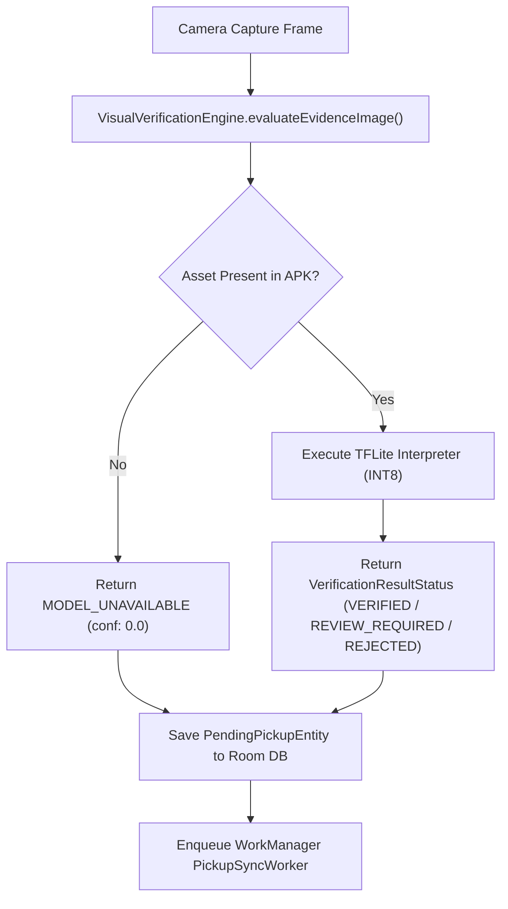

# NIRMALTAG — ANDROID ON-DEVICE AI VISION ARCHITECTURE

## 1. Overview
The Android client features a modular **On-Device Evidence Verification Engine** (`VisualVerificationEngine`) designed to run visual verification on sanitary pouch captures prior to backend transmission.

---

## 2. Model Asset Specification
- **Target Model Architecture**: MobileNetV3-Small (Quantized INT8)
- **Asset Name**: `mobilenetv3_sanitary_quant.tflite`
- **Asset Location**: `android/app/src/main/assets/`
- **Expected Input**: 224x224x3 RGB Normalized Tensor `[1, 224, 224, 3]`
- **Expected Output**: Binary Classification Logits (`[1, 2]` -> `[Pouch_Valid, Contaminated/Non_Sanitary]`)

---

## 3. Strict Truthfulness Policy (No Mock Confidence)

In previous iterations, simulated UI components returned static mock metrics (`0.94f` confidence score). 

**Production Contract Rule**:
1. If the `.tflite` model asset is **NOT** present in `assets/`, `VisualVerificationEngine` **MUST** return:
   - `status` = `VerificationResultStatus.MODEL_UNAVAILABLE`
   - `confidence` = `0.0f`
   - `modelVersion` = `"MODEL_UNAVAILABLE (Asset Missing)"`
   - `isModelAvailable` = `false`
2. The client application **MUST NEVER** report fake high confidence scores (e.g. `0.94f`) when model assets are unpopulated.
3. Server-side validation remains authoritative regardless of client AI output.

---

## 4. Integration Flow

