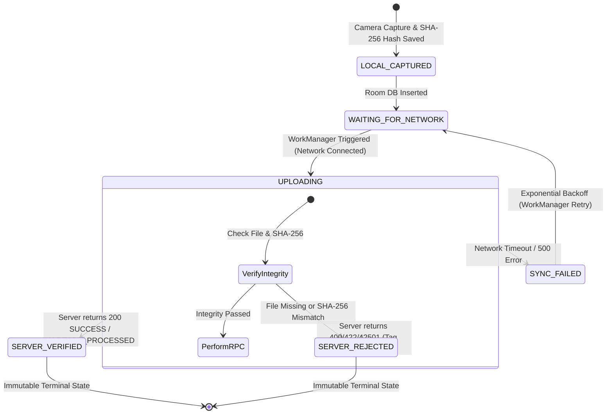

# NIRMALTAG — ANDROID FIELD LOCAL PICKUP STATE MACHINE SPECIFICATION

## 1. Overview & Single Source of Truth
The Android client local pickup state machine tracks the lifecycle of an evidence-backed pickup capture on mobile devices. 
The backend PostgreSQL database remains **100% authoritative**. Local states reflect local queuing, evidence integrity, and network synchronization status.

---

## 2. State Enum Definitions

```kotlin
enum class OfflinePickupState {
    LOCAL_CAPTURED,       // Image and QR tag saved to Room DB & disk
    LOCAL_AI_PENDING,     // Queued for local on-device visual evaluation
    LOCAL_AI_COMPLETED,   // Local AI visual feature vector extracted (or marked MODEL_UNAVAILABLE)
    WAITING_FOR_NETWORK,  // Saved locally, pending active network connection
    UPLOADING,            // Pickup payload being transmitted via WorkManager
    SERVER_PENDING,       // Received by backend, pending async validation
    SERVER_VERIFIED,      // Backend process_verified_pickup_transaction_v2 returned success (200 / ALREADY_PROCESSED)
    SERVER_REJECTED,      // Backend transaction failed (e.g. tag closed, invalid role, household mismatch)
    SYNC_FAILED           // Network error / retryable server error; queued for exponential backoff retry
}
```

---

## 3. Authoritative State Transition Matrix



---

## 4. Key State Invariants

1. **Non-Verification Invariant**: Neither `LOCAL_CAPTURED`, `WAITING_FOR_NETWORK`, `UPLOADING`, nor `SYNC_FAILED` implies server verification. No credits are awarded locally.
2. **Terminal Authority**: Only `SERVER_VERIFIED` received from the authoritative PostgreSQL RPC `process_verified_pickup_transaction_v2` confirms pickup finalization.
3. **Idempotency Key Scope**: A single `idempotencyKey` persists across `WAITING_FOR_NETWORK` $\to$ `UPLOADING` $\to$ `SYNC_FAILED` $\to$ `UPLOADING` cycles.
4. **Fatal Rejection Rules**: Errors such as `CLOSED_TAG`, `HOUSEHOLD_MISMATCH`, `TAG_INVALID_FORMAT`, and `EVIDENCE_HASH_MISMATCH` transition immediately to `SERVER_REJECTED` and are never retried.
