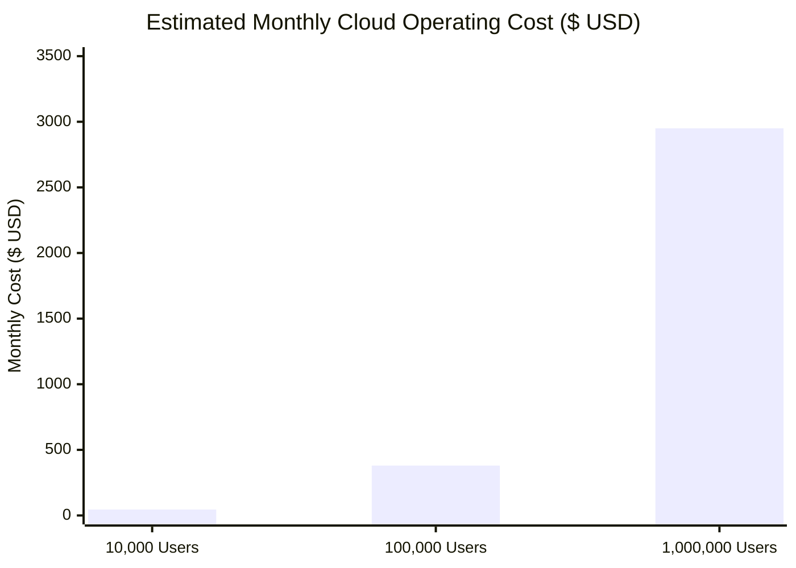

# NIRMALTAG — Cost Model & Financial Projections

## Architectural Cost Drivers

Scaling a civic-tech waste management platform requires understanding platform resource consumption across user growth phases.

---

## Operating Scenarios & Estimates

### Scenario A: 10,000 Active Households (Hackathon / Pilot Phase)
- **Daily Pickups**: ~5,000 collections / day (~150k / month)
- **Database (Supabase Pro)**: $25/mo base (includes 8GB DB, 100k MAU)
- **Storage (Evidence Photos)**: ~15GB compressed ($0.021/GB) = ~$0.32/mo
- **Vercel Web Hosting**: Pro Plan ($20/mo)
- **Firebase Authentication**: Free Tier (First 50,000 MAU free)
- **On-Device AI**: $0.00 (Runs 100% on device CPU/NPU)
- **Estimated Total**: **~$45 - $50 / month**

### Scenario B: 100,000 Active Households (Municipal Zone Deployment)
- **Daily Pickups**: ~50,000 collections / day (~1.5M / month)
- **Database (Supabase Team/Scale)**: $250/mo (Compute instance upgrade, connection pooling)
- **Storage & Egress**: ~150GB evidence storage + bandwidth = ~$35/mo
- **Vercel Enterprise / Pro**: $40/mo
- **Firebase MAU**: ~$55/mo (Tiered authentication)
- **On-Device AI**: $0.00 (On-device execution)
- **Estimated Total**: **~$380 / month** (~$0.0038 per household/month)

### Scenario C: 1,000,000 Active Households (City-Wide MCD Scale)
- **Daily Pickups**: ~500,000 collections / day (~15M / month)
- **Database Cluster (Dedicated PostgreSQL / Supabase Enterprise)**: $1,800/mo
- **Storage & Data Retention**: ~1.5TB evidence storage + CDN egress = ~$350/mo
- **Hosting & Function Compute**: $400/mo
- **Firebase Auth MAU**: ~$400/mo
- **Estimated Total**: **~$2,950 / month** (~$0.0029 per household/month)

---

## Cost Optimization Invariants
1. **On-Device AI Execution**: Zero cloud vision API fees (saving ~$0.0015 per image scan vs cloud vision services = $22,500/mo saved at 15M scans).
2. **Short-Lived Evidence Retention Policy**: Raw pickup evidence images archived/compressed after 90 days to low-cost cold storage.
3. **Database Pre-aggregation**: Realtime dashboards query aggregated stats tables (`ward_daily_aggregates`), preventing expensive full-table scans.
