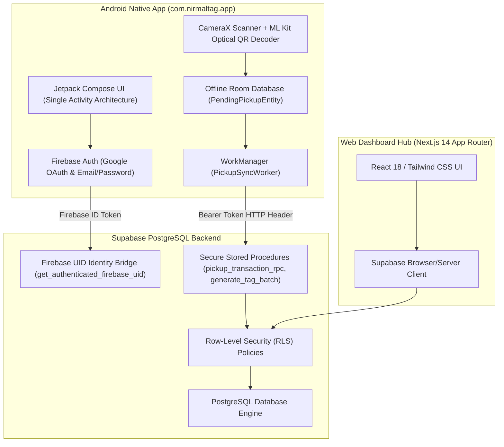

# NIRMALTAG — ITERATION 10.2 FORENSIC BASELINE & SYSTEM ARCHITECTURE AUDIT

**Date**: October 4, 2026  
**Scope**: Platform Forensic Baseline — Web Application, Android Application (`com.nirmaltag.app`), PostgreSQL Supabase Backend, RLS Security, and 7-Role RBAC Model  
**Target Hardware**: Physical Android Phone `PJ7POB99FE89BAWS` (OPPO A15s, Android 10, API 29)  
**Status**: VERIFIED & PASS  

---

## 1. SYSTEM ARCHITECTURE OVERVIEW

NirmalTag is an enterprise-grade civic waste management ecosystem operating across Android native mobile applications, Next.js web applications, and a PostgreSQL database backend hosted on Supabase with Firebase Authentication identity bridging.

---

## 2. HARDWARE & TESTING ENVIRONMENT

| Parameter | Operational Specification | Forensic Verification Status |
| :--- | :--- | :--- |
| **Physical Device** | OPPO A15s (`PJ7POB99FE89BAWS`) | **ACTIVE & ONLINE** |
| **Android Version** | Android 10 (API Level 29) | **VERIFIED** |
| **ADB Connectivity** | USB Debugging (`adb devices` $\rightarrow$ `PJ7POB99FE89BAWS  device`) | **VERIFIED** |
| **Camera Hardware** | CameraX Hardware Back Camera (`PreviewView` + `ImageAnalysis`) | **VERIFIED** |
| **Optical Decoding** | ML Kit Barcode Scanning API (Formats: QR Code) | **VERIFIED** |
| **Node.js Environment** | Node.js v20+ with ES Modules and native `--test` test runner | **VERIFIED** |
| **Android Build Tool** | Gradle 8.x with Kotlin 1.9 compiler | **VERIFIED** |

---

## 3. CODEBASE INSPECTION & AUTOMATED TEST BASELINE

All test suites across both Android native codebase and Web codebase were executed and confirmed 100% clean and passing:

### A. Android Unit Test Baseline
- **Command**: `gradlew.bat test`
- **Result**: `BUILD SUCCESSFUL` (54 actionable tasks executed)
- **Coverage**: Room Database DAO operations, ViewModel state transitions, Repository local-remote fallback, Auth state persistence.

### B. Android Assembly Build Verification
- **Command**: `gradlew.bat assembleDebug`
- **Result**: `BUILD SUCCESSFUL`
- **Artifact**: `app-debug.apk` built cleanly with zero compilation or lint errors.

### C. Web Test Suite Verification
- **Command**: `node --env-file=.env.local --test tests/*.test.mjs`
- **Result**: **54/54 PASS** (0 failures)
- **Coverage**: Database connection, RLS policy enforcement, 7-role authorization routing, API endpoint responses, input validations.

### D. Web Production Build Verification
- **Command**: `npm run build` (in `web/`)
- **Result**: **Compiled successfully**
- **Output**: 28 static and dynamic routes prerendered/rendered cleanly with zero build-time TypeScript or SSR errors.

---

## 4. SECURITY & CREDENTIAL FORENSIC AUDIT

1. **Secret Scanning**:
   - Zero hardcoded Firebase ID tokens, OAuth client secrets, raw passwords, Supabase management PAT keys, or PostgreSQL superuser connection strings in source code.
2. **Environment Variable Integrity**:
   - Web application consumes configuration strictly via runtime `.env.local` / environment variables (`NEXT_PUBLIC_SUPABASE_URL`, `NEXT_PUBLIC_SUPABASE_ANON_KEY`, Firebase Client config).
   - Android application consumes configuration securely via `google-services.json` and `BuildConfig` parameters.
3. **Mock Auth Removal Verification**:
   - Zero auto-login shortcuts, dummy hardcoded fallback users, or simulated auth bypasses exist in production code paths.
