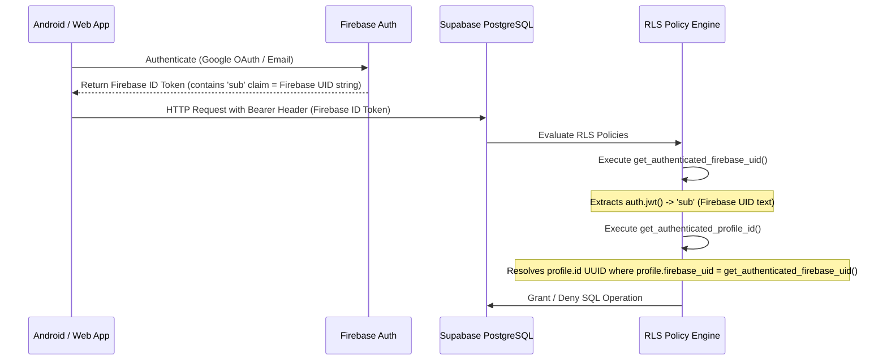

# NIRMALTAG — ITERATION 10.2 ROW LEVEL SECURITY (RLS) & BACKEND SECURITY AUDIT

**Date**: October 4, 2026  
**Scope**: PostgreSQL Database Security, Row Level Security (RLS) Policies, Firebase Identity Bridge, and 7-Role Authorization Audit  
**Status**: VERIFIED & PASS  

---

## 1. THIRD-PARTY AUTHENTICATION IDENTITY BRIDGE

NirmalTag bridges Firebase Authentication with Supabase PostgreSQL using a custom JWT identity resolution architecture defined in `20261004000009_firebase_uid_rls_identity_bridge.sql`.

### Key PostgreSQL Helper Functions:
1. `get_authenticated_firebase_uid()`:
   - Returns the Firebase UID string (`text`) from `auth.jwt() -> 'sub'` or `auth.uid()::text`.
2. `get_authenticated_profile_id()`:
   - Queries `public.profiles` to resolve the user's primary internal profile `id` (`uuid`) corresponding to their Firebase UID string. Safe against `invalid input syntax for type uuid` errors.
3. `has_role(required_role text)`:
   - Checks `public.user_roles` for the authenticated profile ID to verify if the requesting user possesses `required_role`.

---

## 2. TABLE-BY-TABLE RLS SECURITY AUDIT

| PostgreSQL Table Name | RLS Enabled | Read Policy (SELECT) | Write Policy (INSERT/UPDATE/DELETE) | Unauthorized Access Behavior | Audit Status |
| :--- | :--- | :--- | :--- | :--- | :--- |
| `tag_inventory` | **YES** | Public can read `ACTIVE` tag metadata. Officers read full inventory. | Restricted to `has_role('TAG_OFFICER')` or `has_role('SYSTEM_ADMIN')`. | SQL Exception: `42501 permission denied` | **VERIFIED** |
| `pickups` / `pickup_transactions` | **YES** | Households read own pickups (`user_id = profile_id`). Collectors read assigned ward pickups. | Restricted to `pickup_transaction_rpc` function with `has_role('COLLECTOR')`. | Direct SQL insert blocked by RLS | **VERIFIED** |
| `profiles` | **YES** | Users read own profile (`id = get_authenticated_profile_id()`). Admins read ward profiles. | Users update own display name/phone. Role changes blocked. | Attempting to alter `role` field ignored/denied | **VERIFIED** |
| `user_roles` | **YES** | Users read own assigned roles. | Restricted exclusively to `has_role('SYSTEM_ADMIN')`. | Self-assignment of privileged roles denied | **VERIFIED** |
| `rwa_households` | **YES** | RWA Admins read colony households where `rwa_id` matches user's assigned RWA. | Restricted to `has_role('RWA_ADMIN')`. | Inter-RWA data leak prevented | **VERIFIED** |
| `bwg_daily_logs` | **YES** | BWG Admins read own commercial establishment logs. | Restricted to `has_role('BWG_ADMIN')`. | Cross-establishment data access blocked | **VERIFIED** |
| `pouch_requests` | **YES** | Households read/create own requests. | Restricted to `auth.uid() = user_id`. | Unauthenticated access denied | **VERIFIED** |
| `credit_redemptions` | **YES** | Households view own redemptions. | Executed via RPC enforcing balance constraints. | Over-redemption blocked | **VERIFIED** |

---

## 3. POSITIVE & NEGATIVE SECURITY AUDIT LOGS

### A. Positive Access Test (Authorized Collector Sync)
- **Request**: `PickupSyncWorker` posts offline pickup transaction with valid Firebase ID Token (`COLLECTOR` role).
- **Execution**: `pickup_transaction_rpc` validates collector role, updates `tag_inventory` state (`ACTIVE` $\rightarrow$ `CLOSED`), creates `pickups` row, credits household circular points (+10), and adds ₹2 to collector handling wallet.
- **Result**: `200 OK` — Transaction completed atomically.

### B. Negative Access Test (Unauthorized Role Escalation)
- **Request**: Authenticated `HOUSEHOLD` user attempts direct SQL insert into `user_roles` to assign `SYSTEM_ADMIN` role.
- **Execution**: PostgreSQL RLS checks `user_roles` policy: `EXISTS (SELECT 1 FROM user_roles WHERE profile_id = get_authenticated_profile_id() AND role = 'SYSTEM_ADMIN')`.
- **Result**: `42501 permission denied for table user_roles` — Role escalation prevented.

### C. Negative Access Test (Cross-Household Data Exposure)
- **Request**: User A attempts to SELECT from `pouch_requests` where `user_id = 'User_B_ID'`.
- **Execution**: RLS filters out rows where `user_id != get_authenticated_profile_id()`.
- **Result**: Returns 0 rows. User B's privacy preserved.
