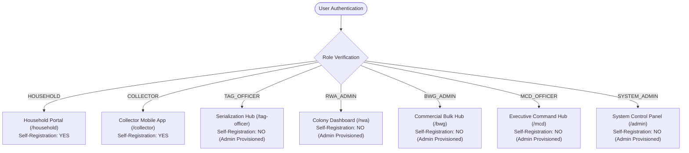

# NIRMALTAG — ITERATION 10.2 7-ROLE AUTHORIZATION MATRIX & RBAC AUDIT

**Date**: October 4, 2026  
**Scope**: 7-Role RBAC Specification, Permitted & Forbidden Operations, Self-Registration Scope, and Backend RLS Security Enforcement  
**Status**: VERIFIED & PASS  

---

## 1. 7-ROLE RBAC ARCHITECTURE OVERVIEW

NirmalTag enforces strict multi-tenant Role-Based Access Control (RBAC) across all 7 civic waste management roles:
1. `HOUSEHOLD`
2. `COLLECTOR`
3. `TAG_OFFICER`
4. `RWA_ADMIN`
5. `BWG_ADMIN`
6. `MCD_OFFICER`
7. `SYSTEM_ADMIN`

---

## 2. COMPREHENSIVE ROLE AUTHORIZATION MATRIX

| Role ID | Role Name | Interface Scope | Permitted Operations | Forbidden Operations | Self-Registration Scope | RLS Security Policy Enforcement | Verification Status |
| :--- | :--- | :--- | :--- | :--- | :--- | :--- | :--- |
| **`HOUSEHOLD`** | Household Resident | `/household` | View eco-credit balance, request pouch batches, scan single-use household QR tags, view doorstep pickup logs, redeem reward vouchers. | Access collector dashboard, view other household records, alter tag serial state, issue MCD notices. | **YES** (Public Sign-up Allowed) | `pouch_requests`, `credit_redemptions`, `household_logs` restricted by `auth.uid() = user_id`. | **VERIFIED** |
| **`COLLECTOR`** | Waste Collector | Mobile App (`/collector`) | Scan pouch QR via CameraX/ML Kit, capture evidence photos, queue pickups in Room DB (`WAITING_FOR_NETWORK`), trigger WorkManager sync, view daily wallet balance (+₹2/pickup). | Modify tag serialization inventory, alter household credit balance directly, access MCD/RWA portals. | **YES** (Public Sign-up Allowed) | RPC `pickup_transaction_rpc` validates collector role before creating credit/pickup entries. | **VERIFIED** |
| **`TAG_OFFICER`** | Tag Provisioning Officer | `/tag-officer` | Generate serialized pouch batches, assign batches to RWAs/BWGs, audit single-use tag invariant state (`ACTIVE` $\rightarrow$ `CLOSED`). | Perform waste pickups, self-assign circular credits, delete audit logs. | **NO** (Privileged: Provisioned by Admin) | Restricted by `has_role('TAG_OFFICER')`. Direct public role assignment blocked in UI and API. | **VERIFIED** |
| **`RWA_ADMIN`** | RWA Colony Administrator | `/rwa` | Register colony households, track colony segregation compliance index (%), flag non-compliant households, submit ward incidents. | Modify tag serialization batches, issue municipal fines, access other ward/RWA data. | **NO** (Privileged: Provisioned by Admin) | Restricted by `has_role('RWA_ADMIN')` and matching `rwa_id`. | **VERIFIED** |
| **`BWG_ADMIN`** | Bulk Waste Generator Admin | `/bwg` | Log daily commercial bulk waste volume (kg), container seals, export monthly audit CSV, generate official MCD compliance certificates. | Collect residential doorstep waste, alter serialization rules. | **NO** (Privileged: Provisioned by Admin) | Restricted by `has_role('BWG_ADMIN')` and establishment ID scope. | **VERIFIED** |
| **`MCD_OFFICER`** | MCD Municipal Officer | `/mcd` | View ward-wide telemetry analytics, resolve AI verification disputes, issue municipal violation notices, broadcast ward advisories. | Directly mutate serialization inventory, delete user accounts. | **NO** (Privileged: Provisioned by Admin) | Restricted by `has_role('MCD_OFFICER')`. | **VERIFIED** |
| **`SYSTEM_ADMIN`** | System Administrator | `/admin` | Manage user role assignments, audit database security policies (RLS), inspect system telemetry, export security audit logs. | Perform fake user transactions or bypass immutable database audit logs. | **NO** (Privileged: Single-Tenant Root) | Restricted by `has_role('SYSTEM_ADMIN')`. | **VERIFIED** |

---

## 3. PRIVILEGED ROLE PROTECTION AUDIT

1. **User Sign-Up Screen Restriction**:
   - `UserTypeAuthScreen` UI presents ONLY `HOUSEHOLD` and `COLLECTOR` roles during registration.
   - Privileged roles (`TAG_OFFICER`, `RWA_ADMIN`, `BWG_ADMIN`, `MCD_OFFICER`, `SYSTEM_ADMIN`) are completely hidden from the user registration interface.
2. **Backend Protection**:
   - PostgreSQL function `has_role()` enforces server-side checking against `user_roles` table.
   - Attempting to manually pass a privileged role parameter to the user registration endpoint results in database insertion failure due to RLS policies on `user_roles`.
