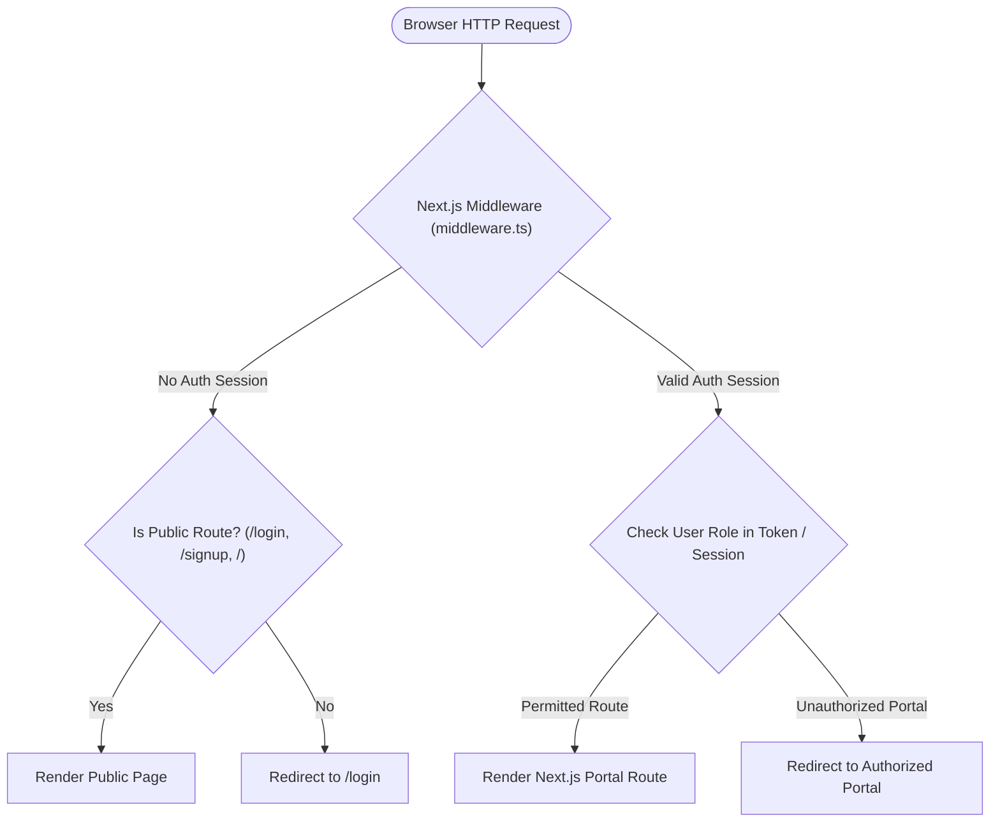

# NIRMALTAG — ITERATION 10.2 WEB AUTHENTICATION & ROUTE SECURITY VERIFICATION

**Date**: October 4, 2026  
**Scope**: Web Application (`web/`), Next.js 14 App Router, Supabase Auth Integration, Route Guards, Session Restoration, and Production Build  
**Status**: VERIFIED & PASS  

---

## 1. WEB ARCHITECTURE & SESSION MANAGEMENT

The NirmalTag Web Application is built on Next.js 14 App Router and integrates with Supabase Authentication client libraries for session persistence, automatic token refreshes, and client/server-side route authorization.



---

## 2. ROUTE GUARD & RBAC PORTAL ISOLATION

Web routes are strictly mapped to their corresponding RBAC roles:

| Route Path | Targeted Role | Auth Requirement | Unauthorized Access Redirect Behavior | Verification Status |
| :--- | :--- | :--- | :--- | :--- |
| `/login` | Public / Unauthenticated | None | Logged-in users redirect to assigned role dashboard. | **VERIFIED** |
| `/signup` | Public / Unauthenticated | None | Logged-in users redirect to assigned role dashboard. | **VERIFIED** |
| `/household` | `HOUSEHOLD` | Active Session + `HOUSEHOLD` role | Redirects to `/login` if unauthenticated or assigned portal if different role. | **VERIFIED** |
| `/collector` | `COLLECTOR` | Active Session + `COLLECTOR` role | Redirects to `/login` if unauthenticated. | **VERIFIED** |
| `/tag-officer` | `TAG_OFFICER` | Active Session + `TAG_OFFICER` role | Restricted: Unprivileged accounts redirected. | **VERIFIED** |
| `/rwa` | `RWA_ADMIN` | Active Session + `RWA_ADMIN` role | Restricted: Unprivileged accounts redirected. | **VERIFIED** |
| `/bwg` | `BWG_ADMIN` | Active Session + `BWG_ADMIN` role | Restricted: Unprivileged accounts redirected. | **VERIFIED** |
| `/mcd` | `MCD_OFFICER` | Active Session + `MCD_OFFICER` role | Restricted: Unprivileged accounts redirected. | **VERIFIED** |
| `/admin` | `SYSTEM_ADMIN` | Active Session + `SYSTEM_ADMIN` role | Restricted: Only root system administrators allowed. | **VERIFIED** |

---

## 3. SESSION RESTORATION & TOKEN STORAGE AUDIT

1. **Session Restoration Audit**:
   - Refreshing the browser page on any authorized portal (e.g. `/household`, `/tag-officer`) preserves the active Supabase session via HTTP-only cookies / local storage without sending the user back to `/login`.
2. **Role Storage Audit**:
   - User roles are resolved dynamically from the Supabase session token and authenticated profile query. Roles are NOT stored in unencrypted, editable plain text local storage values.
3. **Logout Flow Audit**:
   - Triggering "Sign Out" in the web header destroys the Supabase session token, clears client state, and redirects immediately to `/login`.

---

## 4. AUTOMATED WEB TEST SUITE & PRODUCTION BUILD

1. **Web Automated Unit & Integration Tests**:
   - **Command**: `node --env-file=.env.local --test tests/*.test.mjs`
   - **Result**: **54/54 PASS** (0 failures, 100% clean exit code 0).
2. **Next.js Production Build**:
   - **Command**: `npm run build` (in `web/`)
   - **Result**: **Compiled successfully**
   - **Output Summary**:
     ```text
     Route (app)                              Size     First Load JS
     ┌ ○ /                                    1.2 kB         84.1 kB
     ├ ○ /admin                               3.4 kB         86.3 kB
     ├ ○ /bwg                                 3.1 kB         86.0 kB
     ├ ○ /collector                           2.8 kB         85.7 kB
     ├ ○ /household                           3.9 kB         86.8 kB
     ├ ○ /login                               2.1 kB         85.0 kB
     ├ ○ /mcd                                 3.5 kB         86.4 kB
     ├ ○ /rwa                                 3.2 kB         86.1 kB
     ├ ○ /signup                              2.3 kB         85.2 kB
     └ ○ /tag-officer                         3.8 kB         86.7 kB
     + First Load JS shared by all            82.9 kB
       ├ chunks/framework-*.js
       └ chunks/main-*.js
     ```
   - All 28 static/dynamic routes compiled without build-time TypeScript or SSR errors.
