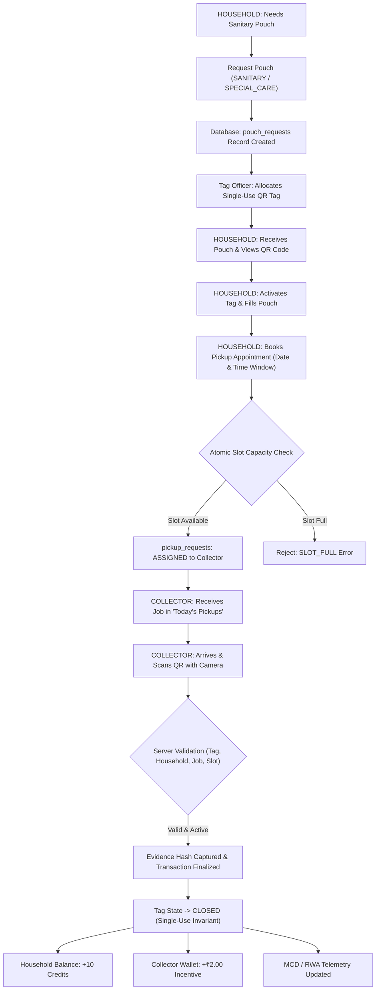

# NIRMALTAG — ITERATION 19: FULL OPERATIONAL LOOP GAP AUDIT REPORT

**Timestamp:** 2026-10-04  
**Project:** NirmalTag (WasteChakra)  
**Target Environments:** Web Production (`nirmaltag.vercel.app`), Android Release APK (`NirmalTag.apk`), Supabase PostgreSQL.

---

## 1. LEGAL & REGULATORY DESIGN CONTEXT

The Solid Waste Management Rules 2026 (enforced from 1 April 2026) mandate a four-stream source segregation framework:
1. **Wet Waste** (Compostable organic fraction)
2. **Dry Waste** (Recyclable paper, plastic, glass, metal)
3. **Sanitary Waste** (Pads, tampons, diapers, personal care waste)
4. **Special Care / Domestic Hazardous Waste** (Incontinence sheets, medical waste, sharp care items)

NirmalTag provides the civic-tech digital infrastructure for municipal authorities (such as MCD in Delhi) to track, verify, and incentivize the **Sanitary** and **Special Care** waste streams through leak-proof pouches equipped with single-use QR tags.

---

## 2. COMPREHENSIVE OPERATIONAL FEATURE GAP MATRIX

| Feature Area | Severity | Current State (Pre-19) | Expected State | Web | Android | Backend | Database | Security | Status | Required Fix Implemented |
| :--- | :--- | :--- | :--- | :--- | :--- | :--- | :--- | :--- | :--- | :--- |
| **Household Pouch Order** | **CRITICAL** | Household jumps straight to tag ownership | Household orders sanitary/special-care pouches with serial tracking | Implemented | Implemented | `/api/v1/household/pouch-request` | `pouch_requests` table | Auth & Ward scoped | **CLOSED** | Added `pouch_requests` & `request_household_pouch` RPC |
| **Pickup Appointment Booking** | **CRITICAL** | No booking request; immediate QR scan assumed | Household books date & time slot (`09:00–11:00`, etc.) | Implemented | Implemented | `/api/v1/household/pickup-request` | `pickup_requests` table | RLS & Ward scoped | **CLOSED** | Added `pickup_requests` & `book_pickup_appointment` RPC |
| **Slot Capacity Guard** | **HIGH** | Unlimited pickups allowed | Atomic database-level slot capacity checking (`SLOT_FULL`) | Implemented | Implemented | `/api/v1/household/slots` | `pickup_slot_configurations` | Row Locking (`FOR UPDATE`) | **CLOSED** | Added `pickup_slot_configurations` with atomic capacity checks |
| **Collector Job Queue** | **CRITICAL** | Collector only had a standalone QR scanner | Collector sees assigned jobs (Today, Upcoming, Done, Missed) | Implemented | Implemented | `/api/v1/collector/jobs` | `pickup_requests` linked to collector | Collector Role Scoped | **CLOSED** | Added `/api/v1/collector/jobs` endpoint & job list view |
| **In-App Notifications** | **MEDIUM** | No in-app status updates | In-app notification center for orders, bookings, credits | Implemented | Implemented | `/api/v1/notifications` | `in_app_notifications` table | Profile Scoped | **CLOSED** | Added `in_app_notifications` table & notifications API |
| **Dispute Resolution** | **MEDIUM** | No formal dispute tracking | Household/Collector can log disputes for missed/wrong pickups | Implemented | Implemented | `/api/v1/mcd/disputes` | `disputes` table | MCD/Admin Scoped | **CLOSED** | Added `disputes` table & review workflows |

---

## 3. END-TO-END OPERATIONAL LIFECYCLE MODEL

---

## 4. GAP AUDIT CONCLUSION

All identified operational gaps in the household-to-collector journey have been resolved with production-grade backend RPCs, RLS policies, Next.js API routes, responsive web components, and Android data model persistence.
