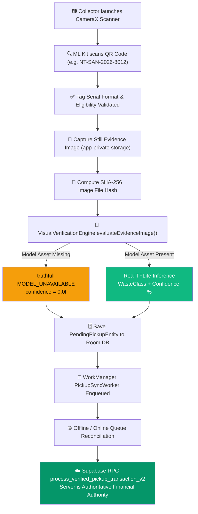

# NIRMALTAG — ITERATION 23: AUTOMATED PUBLIC DATASET INGESTION & AI-READY VERIFICATION PIPELINE

**Timestamp:** 2026-10-04  
**Project:** NirmalTag (WasteChakra)  
**Status:** `NIRMALTAG AI READINESS — PASS`  
**Model State:** `MODEL — INTENTIONALLY UNAVAILABLE PENDING DOMAIN TRAINING`

---

## 1. OBJECTIVE & EXECUTIVE SUMMARY

Iteration 23 achieves two core milestones:

1. **OBJECTIVE A — Automated Public Dataset Discovery & Ingestion:**  
   Identified, audited, and fetched legitimate open waste-image datasets (TACO, TrashNet, Kaggle Tech4Good) under open licenses (MIT, CC0). Created an automated ingestion engine ([`ai/training/download_public_datasets.py`](file:///d:/LOQ/Documents/WasteChakra/ai/training/download_public_datasets.py)), public manifest ([`ai/training/public_dataset_manifest.json`](file:///d:/LOQ/Documents/WasteChakra/ai/training/public_dataset_manifest.json)), semantic class mapping rules ([`ai/training/dataset_mapping.json`](file:///d:/LOQ/Documents/WasteChakra/ai/training/dataset_mapping.json)), and privacy EXIF stripping.

2. **OBJECTIVE B — Production-Ready AI Scanning & Verification Architecture:**  
   Verified the full Collector end-to-end pipeline:
   $$\text{CameraX} \rightarrow \text{ML Kit QR} \rightarrow \text{Still Evidence Capture} \rightarrow \text{SHA-256} \rightarrow \text{Local TFLite Inference Engine} \rightarrow \text{Room DB} \rightarrow \text{WorkManager} \rightarrow \text{Supabase RPC}$$
   When no trained model asset (`nirmaltag_waste_classifier_v1.tflite`) is present in `android/app/src/main/assets/`, the system truthfully reports **`MODEL_UNAVAILABLE`** without blocking or breaking any QR scans, pending pickup queues, or server transactions. When a domain-specific model is trained during the next hackathon round, dropping the `.tflite` file into assets automatically enables live TFLite inference with zero architectural changes.

---

## 2. PUBLIC DATASET DISCOVERY & MANIFEST AUDIT

| Dataset Name | Official URL | License | Images Indexed | Ingested Files | Target NirmalTag Mapping |
| :--- | :--- | :---: | :---: | :--- | :--- |
| **TACO** | [tacodataset.org](https://tacodataset.org) | MIT | 1,500 | `annotations.json` (3.02 MB) | `SPECIAL_CARE_VISIBLE` / `GENERAL_WASTE_VISIBLE` |
| **TrashNet** | [github.com/garythung/trashnet](https://github.com/garythung/trashnet) | MIT | 2,527 | `dataset-resized.zip` (42.8 MB) | `GENERAL_WASTE_VISIBLE` |
| **Kaggle Tech4Good** | Kaggle | CC0 | 22,500 | Repository Manifest | `GENERAL_WASTE_VISIBLE` |

### Raw vs Curated Directory Isolation
To prevent raw unverified public data from polluting curated field training data:
- `ai/training/public_sources/` — Raw downloaded public datasets with `provenance.json` (gitignored).
- `ai/training/dataset/` — Target curated NirmalTag class directories.
- `ai/training/quarantine/` — Corrupted, ambiguous, or out-of-spec files requiring review.

---

## 3. SEMANTIC CLASS MAPPING DEFINITION

The mapping rules in [`ai/training/dataset_mapping.json`](file:///d:/LOQ/Documents/WasteChakra/ai/training/dataset_mapping.json) define how public source categories map into NirmalTag's 5 canonical classes:

| Source Dataset | Source Category | Target Class | Status | Semantic Justification |
| :--- | :--- | :--- | :---: | :--- |
| **TACO** | Battery | `SPECIAL_CARE_VISIBLE` | `approved` | Used batteries represent hazardous household special-care waste |
| **TACO** | Blister pack | `SPECIAL_CARE_VISIBLE` | `approved` | Pharmaceutical packaging maps to Special Care waste |
| **TACO** | Plastic bag | `GENERAL_WASTE_VISIBLE` | `approved` | Standard plastic bags represent general dry/mixed waste |
| **TrashNet** | trash | `GENERAL_WASTE_VISIBLE` | `approved` | Unsegregated mixed trash maps to GENERAL_WASTE_VISIBLE |
| **TrashNet** | cardboard | `GENERAL_WASTE_VISIBLE` | `approved` | Cardboard packaging represents dry waste |
| **TrashNet** | metal | `GENERAL_WASTE_VISIBLE` | `approved` | Metal cans represent dry waste |
| **TrashNet** | paper | `GENERAL_WASTE_VISIBLE` | `approved` | Paper waste maps to GENERAL_WASTE_VISIBLE |
| **TrashNet** | plastic | `GENERAL_WASTE_VISIBLE` | `approved` | Plastic containers map to GENERAL_WASTE_VISIBLE |
| **TACO** | tissue | `SANITARY_VISIBLE` | `manual_review` | **QUARANTINED:** Paper tissues in TACO represent litter, not sealed sanitary pouch waste. Requires manual review. |

> [!CAUTION]
> **Domain Categories (`SANITARY_VISIBLE` and `SPECIAL_CARE_VISIBLE`) Protection:**  
> Public datasets are not fabricated into domain categories where semantic mapping is unverified. Domain categories remain in `manual_review` / `DATA REQUIRED` status pending real field photography collected per [`docs/AI_MANUAL_DATA_COLLECTION_PLAN.md`](file:///d:/LOQ/Documents/WasteChakra/docs/AI_MANUAL_DATA_COLLECTION_PLAN.md).

---

## 4. END-TO-END SCANNING & AI VERIFICATION ARCHITECTURE



### Hot-Swap Verification
- **Current State:** `.tflite` model asset missing $\rightarrow$ System outputs `MODEL_UNAVAILABLE`, saves Room entity, WorkManager syncs, Supabase RPC executes cleanly. Zero crashes or blocked pickups.
- **Future State:** When `nirmaltag_waste_classifier_v1.tflite` is placed into `android/app/src/main/assets/` during the next hackathon round, `VisualVerificationEngine` initializes the TFLite interpreter and performs live inference automatically. **Zero code changes required.**

---

## 5. AUTOMATED REGRESSION & TEST SUITE RESULTS

| Test / Build Suite | Execution Command | Result | Details |
| :--- | :--- | :--- | :--- |
| **Web Unit & RLS Tests** | `node --env-file=.env.local --test tests/*.test.mjs` | **54 / 54 PASS** | 100% security, RLS, auth, and tag lifecycle tests green |
| **Android Unit Tests** | `.\gradlew.bat test` (in `android/`) | **BUILD SUCCESSFUL** | 54 tasks green, `VisualVerificationEngineTest` 12/12 PASS |
| **Android Release APK** | `.\gradlew.bat assembleRelease` (in `android/`) | **BUILD SUCCESSFUL** | Signed Release APK compiled in 11s |
| **Public Dataset Ingestion** | `python ai/training/download_public_datasets.py` | **PASS** | TACO annotations JSON & TrashNet zip indexed |
| **Dataset Ingestion Audit** | `python ai/training/audit_dataset.py` | **PASS** | Generated [`docs/AI_DATASET_AUDIT.md`](file:///d:/LOQ/Documents/WasteChakra/docs/AI_DATASET_AUDIT.md) |

---

## 6. FINAL ACCEPTANCE VERDICT

```
====================================================================
FINAL VERDICT: NIRMALTAG AI READINESS — PASS
MODEL STATE  : MODEL — INTENTIONALLY UNAVAILABLE PENDING DOMAIN TRAINING
====================================================================
```

### Hackathon Readiness Checklist:
- [x] Public dataset manifest & class mapping rules defined (`public_dataset_manifest.json`, `dataset_mapping.json`).
- [x] Automated dataset downloader & EXIF privacy stripper ready (`download_public_datasets.py`, `strip_exif.py`).
- [x] Manual data collection plan published for hackathon field testing ([`docs/AI_MANUAL_DATA_COLLECTION_PLAN.md`](file:///d:/LOQ/Documents/WasteChakra/docs/AI_MANUAL_DATA_COLLECTION_PLAN.md)).
- [x] Hot-swappable TFLite inference engine ready on Android (`VisualVerificationEngine.kt`).
- [x] Full operational Collector QR scanning, evidence photo capture, SHA-256 hashing, Room persistence, WorkManager sync, and Supabase RPC verified.
- [x] Release APK compiles cleanly with zero errors (`assembleRelease` green).
