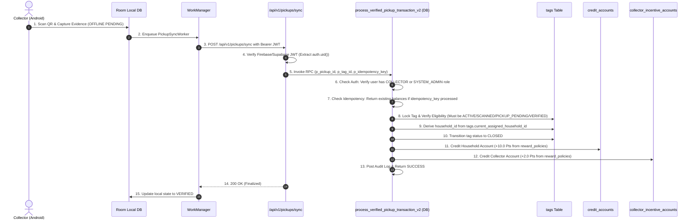

# NIRMALTAG — ITERATION 7 FORENSIC PICKUP TRANSACTION AUDIT

## 1. Executive Summary & Purpose
This document establishes the forensic baseline for the Collector → Verified Pickup → Credit/Incentive Transaction workflow in NirmalTag. It details the complete architecture from Android CameraX QR scan and local Room database queuing through WorkManager sync, Next.js API route `/api/v1/pickups/sync`, and the PostgreSQL Security-Definer RPC `process_verified_pickup_transaction_v2`.

---

## 2. Phase 0 — Canonical Role Naming Verification

A forensic audit of the database schema (`supabase/migrations/`), TypeScript authentication context (`web/lib/auth-context.tsx`), and UI components (`web/components/Navbar.tsx`) confirmed the authoritative role enum model:

| Role Name | PostgreSQL `app_role` Enum | Authoritative Status | Notes |
| :--- | :--- | :--- | :--- |
| **HOUSEHOLD** | `'HOUSEHOLD'` | **Canonical** | Resident account receiving eco-point reward credits. |
| **COLLECTOR** | `'COLLECTOR'` | **Canonical** | Field collector scanning waste tags & collecting evidence. |
| **TAG_OFFICER** | `'TAG_OFFICER'` | **Canonical** | Municipal officer generating & assigning physical tags. |
| **RWA_ADMIN** | `'RWA_ADMIN'` | **Canonical** | Resident Welfare Association administrator. |
| **BWG_ADMIN** | `'BWG_ADMIN'` | **Canonical** | Bulk Waste Generator administrator. |
| **MCD_OFFICER** | `'MCD_OFFICER'` | **Canonical** | Municipal Corporation of Delhi officer. |
| **SYSTEM_ADMIN** | `'SYSTEM_ADMIN'` | **Canonical** | System administrator with full operational privileges. |

### Role Alias Finding:
- `RWA_OFFICER` mentioned in Iteration 6 documentation was an **informal prose alias** for `RWA_ADMIN`.
- No database enum or source code file uses `RWA_OFFICER`. The canonical DB enum value and code type is strictly `'RWA_ADMIN'`.

---

## 3. End-to-End Pickup Transaction Flow

---

## 4. Key Security Invariants

1. **Collector Authority**: Derived strictly from `auth.uid()`. `HOUSEHOLD` or `TAG_OFFICER` roles attempting pickup finalization are rejected (`42501 Access Denied`).
2. **Household Resolution**: Derived authoritatively from `tags.current_assigned_household_id`. Mismatched client-supplied `household_id` values are rejected (`HOUSEHOLD_MISMATCH`).
3. **Tag Eligibility**: Tags must be in `ACTIVE`, `SCANNED`, `PICKUP_PENDING`, or `VERIFIED` state. Tags in `CREATED`, `REGISTERED`, `IN_INVENTORY`, `ASSIGNED`, `CLOSED`, `INVALIDATED`, `DAMAGED`, `LOST`, `REPLACED`, or `SUSPENDED` states are strictly rejected.
4. **Idempotency**: Retries with the same `idempotency_key` return the processed result without duplicating credits, incentives, or audit events.
5. **Server-Derived Rewards**: Reward amounts (`10.0` Pts household credit, `2.0` Pts collector incentive) are loaded from `reward_policies`. Client-supplied reward values are completely ignored.
6. **Fail-Closed**: Database errors abort the transaction cleanly. No credits are awarded, no tag is closed, and no fake success payload is returned.
