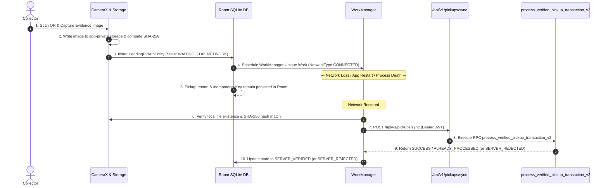

# NIRMALTAG — ITERATION 8 FORENSIC ANDROID FIELD RELIABILITY AUDIT

## 1. Executive Summary & Purpose
This document establishes the forensic baseline for the Android field Collector application. It details the architecture of offline evidence capture, Room local persistence, WorkManager background scheduling, evidence integrity verification, and backend state reconciliation.

---

## 2. Forensic Component Inventory

| Component | Path / Package | Current Responsibilities |
| :--- | :--- | :--- |
| **Offline Pickup State** | `com.nirmaltag.app.data.local.OfflinePickupState` | Enum tracking local lifecycle states (`LOCAL_CAPTURED`, `WAITING_FOR_NETWORK`, `UPLOADING`, `SERVER_VERIFIED`, `SERVER_REJECTED`, `SYNC_FAILED`). |
| **Pending Pickup Entity** | `com.nirmaltag.app.data.local.PendingPickupEntity` | Room entity storing persistent `localPickupId`, immutable `idempotencyKey`, `photoLocalUri`, `photoSha256`, GPS coordinates, AI status, and offline state. |
| **Pickup DAO** | `com.nirmaltag.app.data.local.PickupDao` | Room DAO providing crash-safe insertions, status flow queries, state transitions, and verification updates. |
| **NirmalTag Database** | `com.nirmaltag.app.data.local.NirmalTagDatabase` | Room SQLite database instance holding `pending_pickups`, `auth_sessions`, `sync_queue`, and `tag_cache`. |
| **Pickup Sync Worker** | `com.nirmaltag.app.sync.PickupSyncWorker` | WorkManager `CoroutineWorker` enforcing network constraints (`CONNECTED`), exponential backoff, SHA-256 evidence integrity validation, and server finalization RPCs. |
| **Visual Verification Engine** | `com.nirmaltag.app.ai.VisualVerificationEngine` | On-device visual evaluation engine. Truthfully returns `MODEL_UNAVAILABLE` when physical TFLite model asset is absent from assets. |
| **Main Activity & CameraX** | `com.nirmaltag.app.MainActivity` | Jetpack Compose UI launching CameraX preview, saving captured evidence bytes to app-private storage, computing SHA-256 hashes, inserting into Room, and enqueuing WorkManager sync. |

---

## 3. End-to-End Field Reliability Flow

---

## 4. Crash & Loss Survival Safeguards

1. **Persistent Idempotency Key**: Generated once at initial capture (`UUID.randomUUID()`) and stored in Room. Retained across retries, process death, and device reboot.
2. **App-Private Storage**: Evidence photo bytes written directly to `context.filesDir/pickups/photo_*.jpg`. Never stored in temporary cache dirs or UI memory.
3. **SHA-256 Evidence Integrity**: Verified before upload. Corrupted or missing files immediately trigger `SERVER_REJECTED` status without calling server RPC.
4. **Server Authority**: Local state `WAITING_FOR_NETWORK` or `LOCAL_CAPTURED` never awards credits or closes tags locally. Server RPC finalization is 100% authoritative.
