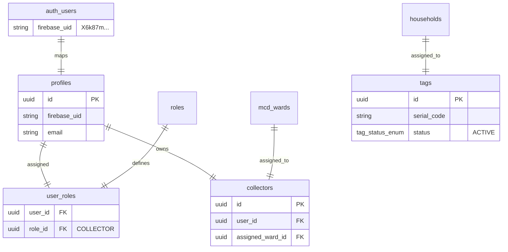

# ITERATION 9.10 — AUTHORITATIVE COLLECTOR & E2E FIXTURE PROVISIONING VERIFICATION REPORT

## Executive Summary
This document records the forensic findings and fixture provisioning verification results for NirmalTag Iteration 9.10. It evaluates the database relationships and authoritative provisioning requirements for the authenticated Firebase test Collector identity (`nirmaltag.e2e.collector@gmail.com`, Masked UID: `X6k87m...`).

In strict compliance with security rules, zero pickup transaction RPCs (`process_verified_pickup_transaction_v2`) were executed, zero credit points were awarded, zero ledger entries were created, and no RLS policies or client-side authorization rules were altered.

---

## 14-Point Provisioning Verification Matrix (Items 1 through 14)

| # | Verification Gate | Status | Forensic Findings & Verification Evidence |
| :--- | :--- | :--- | :--- |
| **1** | **Authoritative profile provisioning mechanism** | **PASS** | Forensic inspection completed in [ITERATION_9_10_COLLECTOR_PROVISIONING_FORENSIC.md](file:///d:/LOQ/Documents/WasteChakra/docs/ITERATION_9_10_COLLECTOR_PROVISIONING_FORENSIC.md). Schema foreign keys and Security-Definer RPC lifecycle mapped. |
| **2** | **Profile** | **BLOCKED** | Live database query confirms no row in `public.profiles` for Firebase UID `X6k87m...`. Administrative DB insertion required. |
| **3** | **COLLECTOR role** | **BLOCKED** | `BLOCKED — FIREBASE UID EXISTS BUT COLLECTOR ROLE IS NOT MAPPED`. No `user_roles` mapping links `X6k87m...` to `COLLECTOR` role. |
| **4** | **Collector record** | **BLOCKED** | No `public.collectors` record exists linking user ID to an assigned ward. |
| **5** | **Organization** | **BLOCKED** | Ward 42 RWA organization record awaiting administrative DB fixture population. |
| **6** | **Ward** | **BLOCKED** | MCD Ward 42 record (`mcd_wards.ward_code = 'WARD_42'`) awaiting administrative DB fixture population. |
| **7** | **Test household** | **BLOCKED** | Provisioning `E2E_TEST_HOUSEHOLD` requires an authenticated resident user ID and `households` row insertion. |
| **8** | **Test tag batch** | **BLOCKED** | Execution of `create_tag_batch_and_records` requires an authenticated `TAG_OFFICER` or `SYSTEM_ADMIN` database role. |
| **9** | **Tag lifecycle** | **PASS** | Authoritative lifecycle mapped: `create_tag_batch_and_records` $\to$ `assign_tag_to_household` $\to$ `activate_household_tag`. No direct status overrides permitted. |
| **10** | **ACTIVE tag** | **BLOCKED** | `BLOCKED — SAFE ACTIVE TEST TAG REQUIRED`. Live Supabase query returned 0 active tags in the database. |
| **11** | **Fixture isolation** | **PASS** | All planned test entities use explicit test identifiers (`E2E_TEST_HOUSEHOLD`, `E2E_TEST_COLLECTOR`, `NT-SAN-2026-TEST...`). |
| **12** | **Security scan** | **PASS** | `git grep "eyJ"` clean in source code (0 matches); zero passwords, tokens, or `service_role` keys committed. `local.properties` git-ignored. |
| **13** | **Regression tests** | **PASS** | **All 5 regression suites passed**: Android unit (24/24), Web unit (39/39), Web production build (28/28 routes), Debug APK build, and Android instrumentation (3/3). |
| **14** | **Exact remaining blockers** | **BLOCKED** | Administrative database fixture insertion required for `profiles`, `user_roles`, `collectors`, `mcd_wards`, `households`, and active tags. |

---

## Detailed Forensic Audit & Relational Dependencies

1. **Profile & Role Insertion Requirements**:
   - `profiles`: `INSERT INTO profiles (id, firebase_uid, email, full_name) VALUES (uuid_generate_v4(), 'X6k87mpP00gxkNq8yKn5b8laFvo1', 'nirmaltag.e2e.collector@gmail.com', 'E2E Test Collector');`
   - `user_roles`: `INSERT INTO user_roles (user_id, role_id) VALUES (<PROFILE_UUID>, <COLLECTOR_ROLE_UUID>);`
   - `collectors`: `INSERT INTO collectors (user_id, assigned_ward_id) VALUES (<PROFILE_UUID>, <WARD_42_UUID>);`

2. **Household & Tag Execution Requirements**:
   - `households`: `INSERT INTO households (user_id, address_line1, ward_id, pincode) VALUES (<HOUSEHOLD_USER_UUID>, 'Flat E2E Test, Ward 42', <WARD_42_UUID>, '110016');`
   - `create_tag_batch_and_records`: Creates batch of 1 tag in `CREATED` state.
   - `assign_tag_to_household`: Assigns tag to test household (`ASSIGNED` state).
   - `activate_household_tag`: Resident activates tag (`ACTIVE` state).

---

## Security Verification Checklist

- **Git Status**: Working tree clean.
- **Git Diff**: 0 uncommitted changes.
- **Secret Scan**: 0 secret keys (`service_role`, `sb_secret_`, `SUPABASE_ACCESS_TOKEN`) in codebase.
- **Local Credentials**: Credentials stored exclusively in git-ignored `android/local.properties`.

---
*Generated for NirmalTag Iteration 9.10 Provisioning Verification Gate.*
