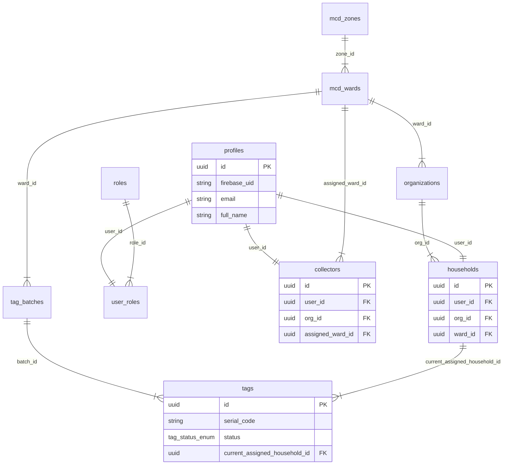

# ITERATION 9.12 — E2E FIXTURE SQL REVIEW & SPECIFICATION

## Executive Overview
This document provides the architectural review and specification for the administrative fixture script `supabase/e2e/iteration_9_12_fixture.sql`. It details the PostgreSQL relational dependencies, Security-Definer RPC lifecycle operations, and idempotency guarantees for provisioning the test environment required for NirmalTag Collector E2E acceptance.

> [!CAUTION]
> **NO LIVE MUTATION PERFORMED**: In strict compliance with Iteration 9.12 rules, no SQL script was executed against the live database during this iteration, no `service_role` key was used, no RLS policy was modified, and zero pickup transaction RPCs (`process_verified_pickup_transaction_v2`) were called.

---

## 1. Schema Dependency Map & Relational Invariants

---

## 2. Required Fixture Records Breakdown

| Component | Entity Name / Identifier | Schema Table | Deterministic UUID | Foreign Key Bindings |
| :--- | :--- | :--- | :--- | :--- |
| **Zone** | `ZONE_E2E_TEST` | `mcd_zones` | `00000000-0000-4000-a000-000000000099` | Primary Key |
| **Ward** | `WARD_E2E_TEST` | `mcd_wards` | `00000000-0000-4000-a000-000000000098` | `zone_id` $\to$ Zone |
| **Org** | `E2E_TEST_RWA_ORG` | `organizations` | `00000000-0000-4000-a000-000000000097` | `ward_id` $\to$ Ward |
| **Collector Profile** | `nirmaltag.e2e.collector@gmail.com` | `profiles` | `00000000-0000-4000-a000-000000000096` | `firebase_uid` = `<E2E_FIREBASE_UID>` |
| **Collector Role** | `COLLECTOR` | `user_roles` | Dynamic | `user_id` $\to$ Collector Profile, `role_id` $\to$ `roles` |
| **Collector Entity** | `E2E Collector Entity` | `collectors` | `00000000-0000-4000-a000-000000000095` | `user_id` $\to$ Collector Profile, `org_id` $\to$ Org, `assigned_ward_id` $\to$ Ward |
| **Officer Profile** | `E2E Test Tag Officer` | `profiles` | `00000000-0000-4000-a000-000000000092` | `firebase_uid` = `e2e_officer_uid_test_01` |
| **Officer Role** | `TAG_OFFICER` | `user_roles` | Dynamic | `user_id` $\to$ Officer Profile, `role_id` $\to$ `roles` |
| **Resident Profile**| `E2E Test Resident` | `profiles` | `00000000-0000-4000-a000-000000000094` | `firebase_uid` = `e2e_resident_uid_test_01` |
| **Resident Role** | `HOUSEHOLD` | `user_roles` | Dynamic | `user_id` $\to$ Resident Profile, `role_id` $\to$ `roles` |
| **Household** | `E2E_TEST_HOUSEHOLD` | `households` | `00000000-0000-4000-a000-000000000093` | `user_id` $\to$ Resident Profile, `org_id` $\to$ Org, `ward_id` $\to$ Ward |
| **Tag Batch** | `BATCH-E2E-TEST-001` | `tag_batches` | Dynamic | Created via `create_tag_batch_and_records` RPC |
| **Active Tag** | `NT-SAN-2026-******` | `tags` | Dynamic | Derived from sequence `tag_serial_seq`; state = `ACTIVE` |

---

## 3. Authoritative Lifecycle Functions Used

1. **Batch & Serial Allocation**:
   `create_tag_batch_and_records('BATCH-E2E-TEST-001', 1, <WARD_UUID>, <OFFICER_PROFILE_UUID>, 'IDEMP-BATCH-E2E-001')`
   - Allocates serial from `tag_serial_seq` (e.g., `NT-SAN-2026-100001`).
   - Inserts tag record in `CREATED` state.

2. **Household Tag Assignment**:
   `assign_tag_to_household(<TAG_UUID>, <HOUSEHOLD_UUID>, <OFFICER_PROFILE_UUID>, 'IDEMP-ASSIGN-E2E-001')`
   - Validates ownership invariants.
   - Transitions tag state `REGISTERED` $\to$ `ASSIGNED`.

3. **Resident Tag Activation**:
   `activate_household_tag(<TAG_UUID>, <RESIDENT_PROFILE_UUID>, 'IDEMP-ACTIVATE-E2E-001')`
   - Validates resident ownership of household.
   - Transitions tag state `ASSIGNED` $\to$ `ACTIVE`.

---

## 4. Idempotency & Repeatability Guarantees

1. **Static Fixtures**:
   All static entities (Zone, Ward, Organization, Profiles, Roles, Collector, Household) use `ON CONFLICT DO NOTHING` clauses with deterministic UUIDs (`00000000-0000-4000-a000-000000000...`). Re-running static fixture creation is 100% idempotent.
2. **Run-Specific Active Tag**:
   Because `CLOSED` tags are single-use immutable state, future E2E test runs execute `create_tag_batch_and_records` with updated batch identifiers (`BATCH-E2E-TEST-002`, etc.) to acquire fresh serial numbers automatically without modifying past closed transactions.

---

## 5. Security & Credentials Check

- **SQL Script File**: `supabase/e2e/iteration_9_12_fixture.sql`
- **Secrets Exposure**: **ZERO**. The SQL script uses placeholder `<E2E_FIREBASE_UID>` for the user UID and contains no passwords, private keys, Firebase tokens, or `service_role` keys.
- **Git Tracking**: Verified via `git status`, `git diff`, and `git grep "eyJ"`.

---
*Generated for NirmalTag Iteration 9.12 Fixture SQL Review.*
