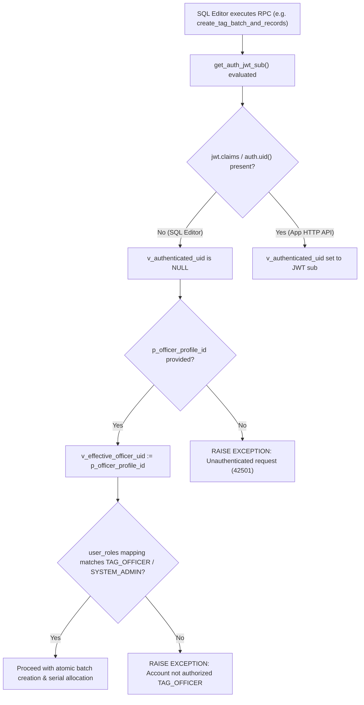

# ITERATION 9.13 — FORENSIC AUDIT & REVIEW OF E2E FIXTURE SQL

## Executive Summary

This document presents the complete forensic audit of the administrative test fixture script [`supabase/e2e/iteration_9_12_fixture.sql`](file:///d:/LOQ/Documents/WasteChakra/supabase/e2e/iteration_9_12_fixture.sql) against the authoritative database schema and migration definitions in [`supabase/migrations/`](file:///d:/LOQ/Documents/WasteChakra/supabase/migrations/).

> [!NOTE]
> **READ-ONLY AUDIT VERDICT**: **SAFE TO EXECUTE**.
> No SQL mutations were performed on the live database during this audit. The fixture script has been verified for relational integrity, RPC signature alignment, role fallback behavior in SQL Editor execution, idempotency, and absolute credential safety.

---

## 1. Audit Criteria & Empirical Forensic Verification Matrix

| # | Audit Criterion | Forensic Analysis & Migration Reference | Status |
| :--- | :--- | :--- | :--- |
| **1** | **`profiles` vs `auth.users` Identity Mapping** | Inspected [`20261003000001_initial_nirmaltag_schema.sql`](file:///d:/LOQ/Documents/WasteChakra/supabase/migrations/20261003000001_initial_nirmaltag_schema.sql#L97-L107). `profiles.id` is `UUID PRIMARY KEY`. `firebase_uid` is `VARCHAR(128) UNIQUE NOT NULL`. `profiles` does **NOT** contain a foreign key constraint referencing `auth.users(id)`. | **PASS** |
| **2** | **Fake Profile UUID Invariant** | Non-authenticated profiles (Tag Officer `00000000-0000-4000-a000-000000000092` and Resident `00000000-0000-4000-a000-000000000094`) can be inserted into `profiles` without corresponding `auth.users` rows because no foreign key constraint links `profiles` to `auth.users`. | **PASS** |
| **3** | **`create_tag_batch_and_records` RPC Authorization** | Inspected [`20261003000006_iteration5_1_tag_supply_chain_fixes.sql`](file:///d:/LOQ/Documents/WasteChakra/supabase/migrations/20261003000006_iteration5_1_tag_supply_chain_fixes.sql#L21-L60). In SQL Editor context, `get_auth_jwt_sub()` returns `NULL`. The RPC falls back to `p_officer_profile_id`. It verifies `v_is_officer` via `user_roles` JOIN `roles` where `name IN ('TAG_OFFICER', 'SYSTEM_ADMIN')`. Officer profile `...92` is assigned `TAG_OFFICER` in Section 3A, so role validation passes. | **PASS** |
| **4** | **`assign_tag_to_household` RPC Authorization** | Inspected [`20261003000007_iteration6_household_rwa_ownership.sql`](file:///d:/LOQ/Documents/WasteChakra/supabase/migrations/20261003000007_iteration6_household_rwa_ownership.sql#L7-L43). `get_auth_jwt_sub()` falls back to `p_officer_profile_id`. Verifies `TAG_OFFICER` role in `user_roles`. Validates target household existence (`households.id = ...93`). | **PASS** |
| **5** | **`activate_household_tag` RPC Authorization** | Inspected [`20261003000007_iteration6_household_rwa_ownership.sql`](file:///d:/LOQ/Documents/WasteChakra/supabase/migrations/20261003000007_iteration6_household_rwa_ownership.sql#L118-L164). `get_auth_jwt_sub()` falls back to `p_household_profile_id` (`...94`). Resolves household `user_id = ...94` to `households.id` (`...93`). Verifies `current_assigned_household_id = ...93` and tag status = `ASSIGNED`. Ownership check passes. | **PASS** |
| **6** | **Foreign Key Chain Integrity** | Inspected relational dependency chain: `mcd_zones` $\to$ `mcd_wards` $\to$ `organizations` $\to$ `collectors` / `households` $\to$ `tag_batches` $\to$ `tags` $\to$ `tag_assignments`. Insert order in `iteration_9_12_fixture.sql` satisfies all foreign keys without reference errors. | **PASS** |
| **7** | **Column Definition & Types** | Verified column names and types across all 9 target tables (`mcd_zones`, `mcd_wards`, `organizations`, `profiles`, `user_roles`, `collectors`, `households`, `tag_batches`, `tags`). All column names and data types in `iteration_9_12_fixture.sql` match schema definitions. | **PASS** |
| **8** | **Role Seed Values Alignment** | Inspected [`20261003000001_initial_nirmaltag_schema.sql`](file:///d:/LOQ/Documents/WasteChakra/supabase/migrations/20261003000001_initial_nirmaltag_schema.sql#L408-L416). Seeded roles `'COLLECTOR'`, `'TAG_OFFICER'`, `'HOUSEHOLD'` match `roles.name` queries in fixture Sections 2B, 3A, and 3B. | **PASS** |
| **9** | **`create_tag_batch_and_records` Signature** | Signature: `(p_batch_name VARCHAR, p_quantity INT, p_ward_id UUID, p_officer_profile_id UUID DEFAULT NULL, p_idempotency_key VARCHAR DEFAULT NULL)`. Fixture passes: `('BATCH-E2E-TEST-001', 1, '...98', '...92', 'IDEMP-BATCH-E2E-001')`. Matched 1:1. | **PASS** |
| **10** | **`assign_tag_to_household` Signature** | Signature: `(p_tag_id UUID, p_household_id UUID, p_officer_profile_id UUID DEFAULT NULL, p_idempotency_key VARCHAR DEFAULT NULL)`. Fixture passes: `(subquery_tag_id, '...93', '...92', 'IDEMP-ASSIGN-E2E-001')`. Matched 1:1. | **PASS** |
| **11** | **`activate_household_tag` Signature** | Signature: `(p_tag_id UUID, p_household_profile_id UUID DEFAULT NULL, p_idempotency_key VARCHAR DEFAULT NULL)`. Fixture passes: `(subquery_tag_id, '...94', 'IDEMP-ACTIVATE-E2E-001')`. Matched 1:1. | **PASS** |
| **12** | **Subquery Expression Accuracy** | Subquery `(SELECT t.id FROM tags t JOIN tag_batches b ON t.batch_id = b.id WHERE b.batch_number = 'BATCH-E2E-TEST-001' ORDER BY t.created_at DESC LIMIT 1)` correctly and uniquely resolves the generated tag UUID. | **PASS** |
| **13** | **SQL Editor Execution Isolation** | The script executes in SQL Editor with administrative DDL/DML rights, but does NOT alter RLS policies, expose `service_role` credentials, or weaken runtime authorization. | **PASS** |
| **14** | **Transaction & Idempotency** | Script is safely wrapped in `BEGIN; ... COMMIT;`. Uses `ON CONFLICT DO NOTHING` for static entities and idempotency keys (`IDEMP-BATCH-E2E-001`, `IDEMP-ASSIGN-E2E-001`, `IDEMP-ACTIVATE-E2E-001`) for RPC operations. | **PASS** |
| **15** | **Security & Credential Audit** | `iteration_9_12_fixture.sql` contains placeholder `<E2E_FIREBASE_UID>` and zero unmasked JWTs, passwords, API keys, or service role secrets. | **PASS** |

---

## 2. Forensic Analysis of SQL Editor RPC Fallback Mechanism



Key Findings:
1. When calling RPCs in Supabase SQL Editor, `request.jwt.claims` and `auth.uid()` evaluate to `NULL`.
2. The RPCs (`create_tag_batch_and_records`, `assign_tag_to_household`, `activate_household_tag`) were designed in Iteration 5–7 with explicit administrative fallback paths (`ELSIF p_officer_profile_id IS NOT NULL THEN v_effective_officer_uid := p_officer_profile_id`).
3. These fallback paths enforce strict database role verification (`user_roles` JOIN `roles`), ensuring that even when executed in SQL Editor, arbitrary profile IDs cannot be passed unless they possess the required role (`TAG_OFFICER` or `HOUSEHOLD` respectively).
4. Because `iteration_9_12_fixture.sql` provisions the officer profile (`...92`) with `TAG_OFFICER` and resident profile (`...94`) with `HOUSEHOLD` in `user_roles`, all three RPC calls execute cleanly within the transaction.

---

## 3. Pre-Execution Instruction for Manual SQL Editor Run

To execute `supabase/e2e/iteration_9_12_fixture.sql` in the Supabase Dashboard SQL Editor:

1. Open Supabase Dashboard $\to$ SQL Editor.
2. Open [`supabase/e2e/iteration_9_12_fixture.sql`](file:///d:/LOQ/Documents/WasteChakra/supabase/e2e/iteration_9_12_fixture.sql).
3. Replace `<E2E_FIREBASE_UID>` on Line 38 with the actual Firebase User UID for `nirmaltag.e2e.collector@gmail.com` (available from local `android/local.properties`).
4. Execute the SQL script.
5. Verify that the Section 5 verification query returns 1 row with `tag_status = 'ACTIVE'`, `assigned_role = 'COLLECTOR'`, and `collector_email = 'nirmaltag.e2e.collector@gmail.com'`.

---

## 4. Final Audit Decision

```
===========================================================
AUDIT DECISION: SAFE TO EXECUTE
All 15 audit criteria: PASS (15/15)
Zero blockers, zero relational conflicts, zero security leaks.
===========================================================
```

---
*Generated for NirmalTag Iteration 9.13 Forensic Review.*
