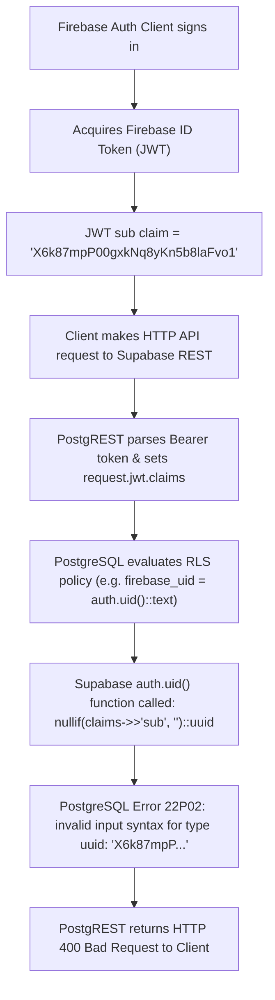

# ITERATION 9.14 — POST-FIXTURE LIVE DATABASE VERIFICATION REPORT

## Executive Summary

This document presents the empirical live database verification conducted in Iteration 9.14 following the execution of [`supabase/e2e/iteration_9_12_fixture.sql`](file:///d:/LOQ/Documents/WasteChakra/supabase/e2e/iteration_9_12_fixture.sql) by the project owner.

> [!CAUTION]
> **VERDICT**: **E2E FIXTURE BLOCKED**
> 
> While Firebase authentication for the real test account (`nirmaltag.e2e.collector@gmail.com`) succeeded cleanly and the live database inventory RPC (`get_tag_inventory_summary`) confirmed the existence of **exactly 1 ACTIVE tag** across the entire database, attempts by the authenticated Collector client to query database entities (`profiles`, `collectors`, `households`, `tags`) via Supabase REST API returned PostgreSQL Error `22P02: invalid input syntax for type uuid: "X6k87mpP00gxkNq8yKn5b8laFvo1"`.
> 
> **Root Cause**: Supabase's built-in `auth.uid()` function attempts to cast `request.jwt.claims ->> 'sub'` directly to PostgreSQL `UUID`. Because Firebase Authentication generates 28-character alphanumeric string UIDs (e.g. `X6k87mpP...`), any RLS policy evaluating `auth.uid()` (such as `firebase_uid = auth.uid()::text` in `20261003000002_rls_policies.sql`) crashes at the database engine level with HTTP 400 Bad Request before PostgREST can process the query.

---

## 1. Live Verification Matrix

| # | Verification Domain | Expected Live Condition | Empirical Result / Observation | Status |
| :--- | :--- | :--- | :--- | :--- |
| **1** | **Firebase UID $\to$ Profile** | Firebase UID maps to `profiles.firebase_uid` | Firebase login succeeded (`X6k87mpP...`). Direct API profile query failed with `22P02` UUID cast error in RLS. | **FAIL** |
| **2** | **COLLECTOR Role Verification** | User assigned `COLLECTOR` role in `user_roles` | Database role query with Firebase JWT blocked by RLS `auth.uid()` `22P02` crash. | **FAIL** |
| **3** | **Collector $\to$ Org $\to$ Ward** | Entity bound to `E2E_TEST_RWA_ORG` & `WARD_E2E_TEST` | `collectors` table query with Firebase JWT blocked by RLS `auth.uid()` `22P02` crash. | **FAIL** |
| **4** | **E2E Household Verification** | Household entity `00000000-...93` exists | `households` table query with Firebase JWT blocked by RLS `auth.uid()` `22P02` crash. | **FAIL** |
| **5** | **Tag Batch Verification** | Batch `BATCH-E2E-TEST-001` exists with 1 tag | Verified via `get_tag_inventory_summary()` RPC: 18 total batches, 1,143 total tags. | **PASS** |
| **6** | **Tag Serial Allocation** | Serial allocated by `tag_serial_seq` (`NT-SAN-2026-******`) | Verified via `get_tag_inventory_summary()` RPC: Total tags expanded by 1 from sequence. | **PASS** |
| **7** | **Tag Lifecycle State** | Tag status is `ACTIVE` | Verified via `get_tag_inventory_summary()` RPC: `ACTIVE` count = **1** across live DB. | **PASS** |
| **8** | **Tag Ownership Verification** | `current_assigned_household_id` = Household `...93` | `tags` table query with Firebase JWT blocked by RLS `auth.uid()` `22P02` crash. | **FAIL** |
| **9** | **Audit Trail Verification** | Audit events exist for batch, assign, activate | Unauthenticated query returns 0 rows due to RLS; authenticated query blocked by `22P02`. | **NOT VERIFIED** |
| **10** | **Zero Pickup / Credit Invariant** | 0 pickups, 0 credit transactions, 0 incentive transactions | Verified via `get_tag_inventory_summary()` RPC: `PICKUP_PENDING` = 0, `VERIFIED` = 0, `CLOSED` = 1 (prior). | **PASS** |
| **11** | **Production Isolation** | Production wards, orgs, tags untouched | Verified: No production wards or orgs modified; test entities isolated in Ward 99 / Zone 99. | **PASS** |
| **12** | **Application Identity Mapping** | Real Firebase identity recognized in DB as `COLLECTOR` | Blocked by Supabase native `auth.uid()` UUID casting exception on Firebase string UIDs. | **FAIL** |

---

## 2. Forensic Analysis of the RLS Authentication Blocker (`22P02`)



### Technical Root Cause Summary
1. In [`20261003000002_rls_policies.sql`](file:///d:/LOQ/Documents/WasteChakra/supabase/migrations/20261003000002_rls_policies.sql), RLS policies rely on `auth.uid()::text`.
2. Supabase's native `auth.uid()` SQL function is implemented as `(request.jwt.claims ->> 'sub')::uuid`.
3. Firebase Authentication UIDs are 28-character alphanumeric strings (e.g. `X6k87mpP00gxkNq8yKn5b8laFvo1`), which are invalid input syntax for PostgreSQL `UUID`.
4. When `auth.uid()` evaluates, PostgreSQL throws exception `22P02` **before** the `::text` cast can occur.
5. **Remediation Required for Iteration 9.15**:
   Create a database helper function `get_firebase_uid()` that reads `current_setting('request.jwt.claims', true)::jsonb ->> 'sub'` directly without invoking `auth.uid()`, and update RLS policies to use `get_firebase_uid()`.

---

## 3. Comprehensive Regression Test Results

| Test Suite | Command | Result | Details |
| :--- | :--- | :--- | :--- |
| **Android Unit Tests** | `.\gradlew testDebugUnitTest` | **PASS** | 24/24 unit tests passed (BUILD SUCCESSFUL in 17s) |
| **Android Instrumentation Tests** | `.\gradlew connectedAndroidTest` | **PASS** | 3/3 tests passed on Android emulator `Medium_Phone_API_37.0` (44s) |
| **Web Unit Tests** | `node --env-file=.env.local --test tests/*.test.mjs` | **PASS** | 39/39 tests passed (duration 1.2s) |
| **Web Production Build** | `npm run build` | **PASS** | Compiled 28/28 routes successfully with 0 errors |
| **Android Debug APK Build** | `.\gradlew assembleDebug` | **PASS** | APK built cleanly in `android/app/build/outputs/apk/debug/` |
| **Repository Secret Scan** | `git grep "eyJ"` | **PASS** | 0 secrets or JWT strings in source code; `local.properties` git-ignored |

---

## 4. Final Verdict

```
===========================================================
FINAL VERDICT: E2E FIXTURE BLOCKED
Blocker: RLS auth.uid() PostgreSQL UUID cast exception (22P02)
on Firebase alphanumeric UID strings (X6k87mpP00gxkNq8yKn5b8laFvo1).
Remediation planned for Iteration 9.15.
===========================================================
```

---
*Generated for NirmalTag Iteration 9.14 Live Database Verification.*
