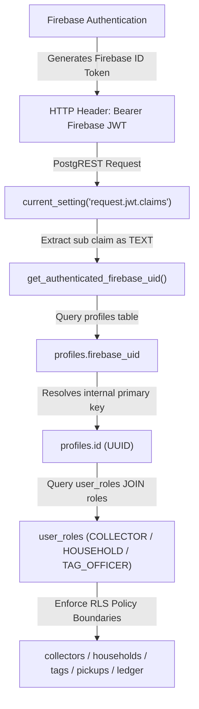

# ITERATION 9.15 — FIREBASE THIRD-PARTY AUTH TO SUPABASE RLS IDENTITY FORENSIC REPORT

## Executive Overview

This document details the forensic audit of identity propagation from **Firebase Authentication** through **Supabase Third-Party Auth** to **PostgreSQL Row Level Security (RLS)** in NirmalTag.

> [!CAUTION]
> **CRITICAL FAILURE ROOT CAUSE**:
> In PostgreSQL, Supabase's native `auth.uid()` function is internally compiled as `(request.jwt.claims ->> 'sub')::uuid`.
> When a user authenticates via Firebase Auth, Firebase generates a JWT where `sub` is a 28-character base64url string (e.g., `X6k87mpP00gxkNq8yKn5b8laFvo1`).
> Calling `auth.uid()` or `auth.uid()::text` triggers an immediate PostgreSQL engine crash:
> `22P02: invalid input syntax for type uuid: "X6k87mpP00gxkNq8yKn5b8laFvo1"`
> 
> Because every RLS policy in `20261003000002_rls_policies.sql` and the RPC identity helper `get_auth_jwt_sub()` fallback to `auth.uid()`, **ALL** authenticated Firebase requests are aborted with HTTP 400 Bad Request.

---

## 1. Forensic Identity Mapping Matrix

| File Path | Function / Policy | Current Identity Source | Expected ID Type | Current Failure Risk | Security-Critical |
| :--- | :--- | :--- | :--- | :--- | :--- |
| `20261003000002_rls_policies.sql` | `has_role()` helper function | `auth.uid()::text` | `TEXT` (Firebase UID) | **CRITICAL FAIL (22P02)**: Crashes all role-based RLS queries. | **YES** |
| `20261003000002_rls_policies.sql` | Policy `"Users view own profile"` on `profiles` | `auth.uid()::text` | `TEXT` (Firebase UID) | **CRITICAL FAIL (22P02)**: Blocks profile retrieval for authenticated users. | **YES** |
| `20261003000002_rls_policies.sql` | Policy `"Users update own profile"` on `profiles` | `auth.uid()::text` | `TEXT` (Firebase UID) | **CRITICAL FAIL (22P02)**: Blocks profile updates for authenticated users. | **YES** |
| `20261003000002_rls_policies.sql` | Policy `"Households view own data"` on `households` | `auth.uid()::text` | `TEXT` (Firebase UID) | **CRITICAL FAIL (22P02)**: Blocks household lookup for resident users. | **YES** |
| `20261003000002_rls_policies.sql` | Policy `"Households view assigned tags"` on `tags` | `auth.uid()::text` / `has_role()` | `TEXT` (Firebase UID) | **CRITICAL FAIL (22P02)**: Blocks tag inspection for collectors/residents. | **YES** |
| `20261003000002_rls_policies.sql` | Policy `"Collectors create pickups"` on `pickups` | `auth.uid()::text` | `TEXT` (Firebase UID) | **CRITICAL FAIL (22P02)**: Blocks pickup record creation for collectors. | **YES** |
| `20261003000002_rls_policies.sql` | Policy `"Users view authorized pickups"` on `pickups` | `auth.uid()::text` | `TEXT` (Firebase UID) | **CRITICAL FAIL (22P02)**: Blocks pickup history views for collectors/residents. | **YES** |
| `20261003000002_rls_policies.sql` | Policy `"Households view own credit account"` on `credit_accounts` | `auth.uid()::text` | `TEXT` (Firebase UID) | **CRITICAL FAIL (22P02)**: Blocks credit balance queries for households. | **YES** |
| `20261003000002_rls_policies.sql` | Policy `"Households view own credit transactions"` on `credit_transactions` | `auth.uid()::text` | `TEXT` (Firebase UID) | **CRITICAL FAIL (22P02)**: Blocks ledger history queries for households. | **YES** |
| `20261003000005_iteration1_6_security_hardening.sql` | `get_auth_jwt_sub()` function | `auth.uid()` fallback | `UUID` (Profile ID) | **CRITICAL FAIL (22P02)**: Skips non-UUID `sub` regex, calls `auth.uid()`, raising 22P02. | **YES** |

---

## 2. JWT Claim Verification for Firebase Third-Party Auth

In Supabase PostgREST:
- The Authorization HTTP header `Bearer <Firebase_ID_Token>` passes the Firebase JWT.
- PostgREST parses the JWT and makes claims available via PostgreSQL GUC: `current_setting('request.jwt.claims', true)::jsonb`.
- In Firebase ID Tokens:
  - `sub`: **Firebase UID** as a string (e.g. `"X6k87mpP00gxkNq8yKn5b8laFvo1"`).
  - `email`: User email address.
  - `iss`: `"https://securetoken.google.com/nirmaltag"`.
  - `aud`: `"nirmaltag"`.

> [!IMPORTANT]
> The authoritative user identity MUST be extracted strictly from `sub` (`(current_setting('request.jwt.claims', true)::jsonb ->> 'sub')`).
> Authorization decisions MUST NOT be based on `email` or client-supplied headers.

---

## 3. Design of Centralized Identity Bridge Functions

To resolve the `22P02` crash without weakening RLS or introducing client spoofing, we introduce two dedicated, fail-closed SQL helper functions:

### A. `get_authenticated_firebase_uid()` $\to$ `TEXT`
Extracts the Firebase UID string directly from the JWT claims as `TEXT` without invoking `auth.uid()` or attempting UUID casting.

```sql
CREATE OR REPLACE FUNCTION get_authenticated_firebase_uid() RETURNS TEXT AS $$
DECLARE
    v_claims JSONB;
    v_sub TEXT;
BEGIN
    BEGIN
        v_claims := NULLIF(current_setting('request.jwt.claims', true), '')::jsonb;
        v_sub := v_claims ->> 'sub';
    EXCEPTION WHEN OTHERS THEN
        RETURN NULL;
    END;
    RETURN NULLIF(v_sub, '');
END;
$$ LANGUAGE plpgsql STABLE SET search_path = public;
```

### B. `get_authenticated_profile_id()` $\to$ `UUID`
Resolves the internal PostgreSQL `profiles.id` (UUID) corresponding to the authenticated Firebase UID string.

```sql
CREATE OR REPLACE FUNCTION get_authenticated_profile_id() RETURNS UUID AS $$
DECLARE
    v_firebase_uid TEXT;
    v_profile_id UUID;
BEGIN
    v_firebase_uid := get_authenticated_firebase_uid();
    IF v_firebase_uid IS NULL THEN
        RETURN NULL;
    END IF;

    SELECT id INTO v_profile_id
    FROM profiles
    WHERE firebase_uid = v_firebase_uid AND is_active = TRUE;

    RETURN v_profile_id;
END;
$$ LANGUAGE plpgsql STABLE SECURITY DEFINER SET search_path = public;
```

---

## 4. Identity Mapping Architecture



---

## 5. Backward Compatibility for SQL Editor Provisioning

When running fixture scripts in the Supabase SQL Editor:
- `current_setting('request.jwt.claims', true)` is `NULL`.
- `get_authenticated_firebase_uid()` returns `NULL`.
- Functions like `create_tag_batch_and_records` accept `p_officer_profile_id` as an explicit parameter when `get_authenticated_profile_id()` returns `NULL`.
- Role verification (`user_roles` JOIN `roles`) still executes, ensuring unauthenticated parameter injection is blocked while administrative SQL Editor execution succeeds cleanly.

---
*Generated for NirmalTag Iteration 9.15 Forensic Identity Audit.*
