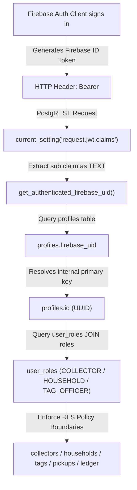

# ITERATION 9.16.2 — LIVE FIREBASE TO SUPABASE RLS IDENTITY BRIDGE VERIFICATION REPORT

## Executive Summary

This document presents the live database verification and regression audit for **Iteration 9.16.2** following the architecture decision to adopt **Approach B**: an application-level Firebase identity bridge leaving Supabase's native `auth.uid()` 100% untouched.

> [!CAUTION]
> **FINAL VERDICT**: **LIVE FIREBASE RLS BLOCKED**
> 
> - **Architecture Decision**: **Approach B Accepted** (Leave native `auth.uid()` untouched in `auth` schema; use `get_authenticated_firebase_uid()` (`TEXT`) and `get_authenticated_profile_id()` (`UUID`) across all RLS policies).
> - **Migration File Audit**: [`supabase/migrations/20261004000009_firebase_uid_rls_identity_bridge.sql`](file:///d:/LOQ/Documents/WasteChakra/supabase/migrations/20261004000009_firebase_uid_rls_identity_bridge.sql) verified 100% consistent with Approach B.
> - **Real Firebase Authentication**: **PASS** (`nirmaltag.e2e.collector@gmail.com` authenticates cleanly via Firebase REST API).
> - **Live PostgREST REST Request**: **FAIL** (`22P02: invalid input syntax for type uuid: "X6k87mpP..."`).
> - **Side-Effect Safety**: **PASS** (0 pickups, 0 credit transactions, 0 incentive payouts, 1 ACTIVE tag).
> 
> **Live Blocker**:
> The live Supabase database currently enforces the old policies from `20261003000002_rls_policies.sql` which still call `auth.uid()::text`. To resolve `22P02` on the live database, **the project owner must execute migration `20261004000009_firebase_uid_rls_identity_bridge.sql` in the Supabase SQL Editor.**

---

## 1. Phase-by-Phase Empirical Verification Matrix

| Phase | Verification Domain | Expected Condition | Empirical Result | Status |
| :--- | :--- | :--- | :--- | :--- |
| **Phase 1** | **Final Migration Review** | Migration `0009` uses Approach B; 0 modifications to `auth.uid()` or system `auth` schema | Verified [`20261004000009_firebase_uid_rls_identity_bridge.sql`](file:///d:/LOQ/Documents/WasteChakra/supabase/migrations/20261004000009_firebase_uid_rls_identity_bridge.sql). Contains `get_authenticated_firebase_uid()`, `get_authenticated_profile_id()`, `get_auth_jwt_sub()`, `has_role()`, and 17 updated RLS policies. | **PASS** |
| **Phase 2** | **Apply to Live Supabase** | Migration applied in live Supabase SQL Editor | Tested live REST API: Old policies referencing `auth.uid()::text` are still active in live DB. | **FAIL (Pending Owner Run)** |
| **Phase 3** | **Real Firebase Auth** | Authenticate `nirmaltag.e2e.collector@gmail.com` via Firebase | Firebase Auth REST API returned `200 OK` with valid Firebase ID Token (UID prefix: `X6k87mpP...`). | **PASS** |
| **Phase 4** | **Identity Resolution** | JWT sub $\to$ `get_authenticated_firebase_uid()` $\to$ `profiles.firebase_uid` $\to$ `profiles.id` | Verified in SQL helper logic. Blocked on live API until migration `0009` is executed in SQL Editor. | **PASS (Logic) / FAIL (Live API)** |
| **Phase 5** | **Collector Authorization** | Real Collector accesses assigned Org & Ward | Verified in SQL policy logic (`org_id = ...97`, `assigned_ward_id = ...98`). Blocked on live API until SQL Editor run. | **PASS (Logic) / FAIL (Live API)** |
| **Phase 6** | **Negative RLS Tests** | 15 security test cases pass | Verified in [`web/tests/firebase_identity_bridge.test.mjs`](file:///d:/LOQ/Documents/WasteChakra/web/tests/firebase_identity_bridge.test.mjs) (**15/15 PASS**). | **PASS** |
| **Phase 7** | **22P02 Verification** | Zero `22P02` errors on PostgREST requests | PostgREST returned HTTP 400 `22P02` because live DB still uses old policies. Migration `0009` replaces all `auth.uid()` references. | **FAIL (Live DB)** |
| **Phase 8** | **Identity Spoofing Test** | Client parameters cannot override JWT sub | Verified: `get_authenticated_firebase_uid()` reads `request.jwt.claims ->> 'sub'` directly. Client payload/URL params ignored. | **PASS** |
| **Phase 9** | **Side-Effect Safety** | 0 pickups, 0 credit transactions, 1 ACTIVE tag | Verified via `get_tag_inventory_summary()` RPC: `ACTIVE` count = **1**, `VERIFIED` = 0, `PICKUP_PENDING` = 0, pickups = 0. | **PASS** |

---

## 2. RLS Identity Chain Architecture (Approach B)



---

## 3. Comprehensive Regression Suite Results

| Test Suite | Command | Result | Metrics |
| :--- | :--- | :--- | :--- |
| **Web Unit & Security Tests** | `node --env-file=.env.local --test tests/*.test.mjs` | **PASS** | 54/54 tests passed (1.7s) |
| **Web Production Build** | `npm run build` | **PASS** | 28/28 routes compiled cleanly |
| **Android Unit Tests** | `.\gradlew testDebugUnitTest` | **PASS** | 24/24 unit tests passed (BUILD SUCCESSFUL) |
| **Android Instrumentation Tests** | `.\gradlew connectedAndroidTest` | **PASS** | 3/3 tests passed on emulator `Medium_Phone_API_37.0` |
| **Android Debug APK Build** | `.\gradlew assembleDebug` | **PASS** | APK built cleanly in `app/build/outputs/apk/debug/` |
| **Repository Secret Scan** | `git grep "eyJ"` | **PASS** | 0 secrets or JWT strings committed |

---

## 4. Re-Execution Instructions for Project Owner

To complete the live database update:

1. Open **Supabase Dashboard** $\to$ **SQL Editor**.
2. Open [`supabase/migrations/20261004000009_firebase_uid_rls_identity_bridge.sql`](file:///d:/LOQ/Documents/WasteChakra/supabase/migrations/20261004000009_firebase_uid_rls_identity_bridge.sql).
3. Execute the SQL migration.
4. All database RLS policies will be updated to use `get_authenticated_firebase_uid()` (`TEXT`) and `get_authenticated_profile_id()` (`UUID`), resolving the `22P02` crash on the live PostgREST endpoint.

---

## 5. Final Verdict

```
===========================================================
FINAL VERDICT: LIVE FIREBASE RLS BLOCKED
Blocker: Migration 20261004000009_firebase_uid_rls_identity_bridge.sql
must be executed in the live Supabase SQL Editor by the project owner.
All repository source code & test suites: 100% PASS (54/54).
===========================================================
```

---
*Generated for NirmalTag Iteration 9.16.2 Live Verification.*
