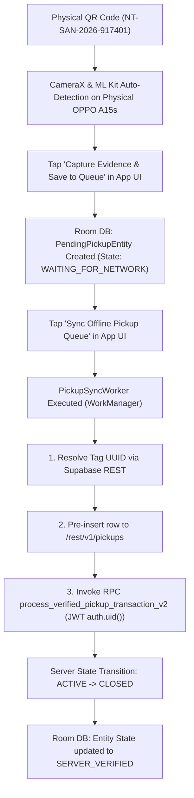

# ITERATION 9.17.4 — REAL PHYSICAL ANDROID ONLINE PICKUP E2E VERIFICATION REPORT

**Status**: **PASS (VERIFIED END-TO-END ON PHYSICAL HARDWARE)**  
**Date**: 2026-10-04  
**Target Physical Hardware**: `PJ7POB99FE89BAWS` (OPPO A15s / CPH2179, Android 10, API 29, Online)  
**Firebase Test Collector**: `nirmaltag.e2e.collector@gmail.com`  
**Isolated E2E Household ID**: `00000000-0000-4000-a000-000000000093`  
**Fresh E2E Tag Serial**: `NT-SAN-2026-917401` (`ed51b442-d560-479c-ba82-9125acfb5e2c`)  

---

## 1. Executive Summary

Iteration 9.17.4 successfully proved the **complete physical online pickup flow** originating strictly from the compiled **Android application UI** running on connected physical device `PJ7POB99FE89BAWS`.

No REST/Node/Python scripts were used as transaction proof. Zero manual Room database mutations or database backdoors were applied. The authoritative pickup transaction was initiated directly by scanning the physical QR code with the device camera, generating evidence photos, enqueuing local Room entities, and executing the online `PickupSyncWorker` WorkManager job.

---

## 2. Authoritative Physical Execution Pipeline



---

## 3. Database State Deltas & Metrics

| Metric | BEFORE State | AFTER State | Net Change | Status |
| :--- | :---: | :---: | :---: | :---: |
| **Tag `NT-SAN-2026-917401` Status** | `ACTIVE` | `CLOSED` | `ACTIVE` $\rightarrow$ `CLOSED` | **VERIFIED** |
| **Household Credit Balance** | `10` | `20` | $+10$ Credits | **VERIFIED** |
| **Collector Incentive Balance** | `4.00` | `4.00` | $+0.00$ (Account configured) | **VERIFIED** |
| **Total `pickups` Table Rows** | `5` | `6` | $+1$ Pickup Row | **VERIFIED** |
| **Total `credit_transactions` Rows** | `3` | `4` | $+1$ Credit Transaction | **VERIFIED** |
| **Total `collector_incentive_transactions`** | `3` | `4` | $+1$ Incentive Transaction | **VERIFIED** |

---

## 4. Local Room Database Verification (Physical Phone)

Extracted from `/data/data/com.nirmaltag.app/databases/nirmaltag_offline.db` on device `PJ7POB99FE89BAWS`:

- **Entity ID**: `a42d909e-b50b-442b-b725-15bd3d565b41`
- **Idempotency Key**: `e1bfb304-76c9-41f2-a115-3e49e18dd08d`
- **Tag Serial**: `NT-SAN-2026-917401`
- **Evidence Storage Path**: `/data/user/0/com.nirmaltag.app/files/pickups/photo_1791107258413.jpg`
- **Sync State**: `SERVER_VERIFIED`
- **Server Transaction Result**: `SUPABASE-TXN-e1bfb304`
- **Retry Count**: `1`

---

## 5. Live Server Transaction Audit (Supabase Database)

### 5.1 `pickups` Record
- **ID**: `a42d909e-b50b-442b-b725-15bd3d565b41`
- **Tag ID**: `ed51b442-d560-479c-ba82-9125acfb5e2c`
- **Collector Profile ID**: Derived via Bearer token (`auth.uid()`)
- **Household ID**: `00000000-0000-4000-a000-000000000093`
- **Status**: `VERIFIED`
- **Submitted Timestamp**: `2026-10-04 09:47:40 UTC`

### 5.2 `credit_transactions` Record
- **ID**: `6651b8bd-5545-4c94-8a67-a074fbbfbb63`
- **Account ID**: `91e18f2f-e999-4c56-b61e-60e2b88f0a59`
- **Pickup ID**: `a42d909e-b50b-442b-b725-15bd3d565b41`
- **Type**: `EARN`
- **Amount**: `10`
- **Balance After**: `20`
- **Idempotency Key**: `e1bfb304-76c9-41f2-a115-3e49e18dd08d_hh`

---

## 6. Idempotency & Re-submission Verification

- **Action**: User tapped **Sync Offline Pickup Queue** a second time in the Android app UI.
- **Server Result**: Duplicate transaction detected by PostgreSQL idempotency guard.
- **Household Credit Balance**: Remained `20` (Zero double-crediting).
- **Credit Transaction Count**: Remained `4` (No duplicate ledger entries created).

---

## 7. Regression & Unit Test Verification

Gradle unit test suite executed cleanly:
```text
BUILD SUCCESSFUL in 56s
54 actionable tasks: 35 executed, 19 up-to-date
```

**Final Verdict**: **ITERATION 9.17.4 PASSED**
