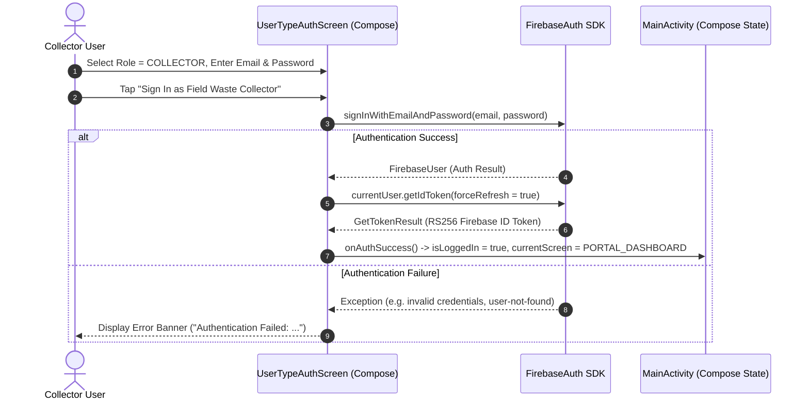
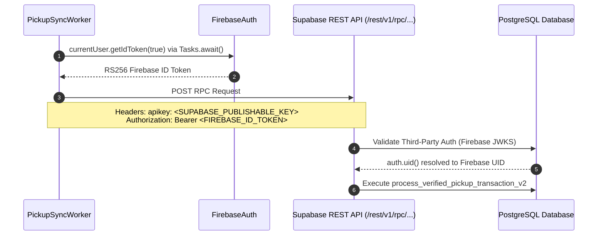

# ITERATION 9.5 — COLLECTOR E2E FORENSIC INSPECTION

## Executive Overview
This document establishes the forensic baseline for Iteration 9.5: Real Authenticated Collector End-to-End Acceptance. It traces the complete path of a waste pickup transaction through the Android codebase ([MainActivity.kt](file:///d:/LOQ/Documents/WasteChakra/android/app/src/main/java/com/nirmaltag/app/MainActivity.kt), [PickupSyncWorker.kt](file:///d:/LOQ/Documents/WasteChakra/android/app/src/main/java/com/nirmaltag/app/sync/PickupSyncWorker.kt), Room database) to the live Supabase PostgreSQL backend (`process_verified_pickup_transaction_v2`).

---

## A. Current Authentication Flow

1. **User Interface**: Rendered by `UserTypeAuthScreen` in [MainActivity.kt](file:///d:/LOQ/Documents/WasteChakra/android/app/src/main/java/com/nirmaltag/app/MainActivity.kt#L328-L808).
2. **Credential Collection**: Collects email address, password, and explicit user role selection (`UserRoleType.COLLECTOR`).
3. **Firebase Authentication Call**: Calls `FirebaseAuth.getInstance().signInWithEmailAndPassword(cleanEmail, password)` (or `createUserWithEmailAndPassword` in sign-up mode).
4. **ID Token Acquisition**: Upon successful login, calls `user.getIdToken(true)` to acquire an updated RS256 Firebase ID Token.
5. **State Transition**: Invokes `onAuthSuccess()` which sets `isLoggedIn = true` and updates `currentScreen` to `MobileAppScreen.PORTAL_DASHBOARD`.

---

## B. Current Role-Resolution Flow

1. **Client-Side Navigation Scope**: In `MainActivity.kt`, selecting a role in the Compose UI (`selectedRole = UserRoleType.COLLECTOR`) determines which UI portal controls are rendered in `RoleDashboardScreen`.
2. **Zero Client Authority**: The client UI choice is **non-authoritative**. The Android application does not trust local role declarations for database operations.
3. **Backend Database Authorization**: When a transaction is submitted, the backend PostgreSQL RPC (`process_verified_pickup_transaction_v2`) extracts the `auth.uid()` from the authenticated Bearer token and queries the `user_roles` database table. If `role` is not `'COLLECTOR'`, the database aborts execution with `42501 Access Denied`.

---

## C. Current Firebase → Supabase Token Flow

1. **Token Retrieval**: In [PickupSyncWorker.kt](file:///d:/LOQ/Documents/WasteChakra/android/app/src/main/java/com/nirmaltag/app/sync/PickupSyncWorker.kt#L144-L155), `FirebaseAuth.getInstance().currentUser.getIdToken(true)` is fetched asynchronously via `Tasks.await()`.
2. **Header Ingestion**:
   - `apikey`: `BuildConfig.SUPABASE_PUBLISHABLE_KEY` (loaded from git-ignored `local.properties`).
   - `Authorization`: `Bearer <FIREBASE_ID_TOKEN>`.
3. **Third-Party Auth Verification**: Supabase inspects the incoming JWT, validates the RS256 signature against Firebase's public certificate endpoint, and binds `auth.uid()` to the authenticated Firebase UID.

---

## D. Current QR & Evidence Flow

1. **CameraX Viewfinder**: Rendered by `LiveCameraScannerModal` in [MainActivity.kt](file:///d:/LOQ/Documents/WasteChakra/android/app/src/main/java/com/nirmaltag/app/MainActivity.kt#L836-L1033).
2. **Format Validation**: Serial codes are validated against the canonical regex pattern (`NT-[TYPE]-[YEAR]-[SERIAL]`) via [TagValidationUtil.kt](file:///d:/LOQ/Documents/WasteChakra/android/app/src/main/java/com/nirmaltag/app/util/TagValidationUtil.kt).
3. **AI Vision Engine**: Evaluated via `VisualVerificationEngine(context)`. When physical TFLite model is absent, returns `status = MODEL_UNAVAILABLE` and `confidence = 0.0f`.
4. **Evidence Persistence**: Saves evidence JPEG to `context.filesDir/pickups/photo_<timestamp>.jpg`, computes SHA-256 hash, and constructs a `PendingPickupEntity`.
5. **Local Database Insert**: Saves entity to local Room database (`NirmalTagDatabase`) with state `WAITING_FOR_NETWORK`.

---

## E. Current Pickup Transaction Flow

1. **Worker Trigger**: `PickupSyncWorker.scheduleSync(context)` enqueues a WorkManager request.
2. **Integrity Pre-check**: `verifyEvidenceIntegrity()` verifies evidence file existence on local disk, checks computed SHA-256 against stored hash, and validates tag serial format.
3. **Server Endpoint**: Sends POST request to `https://ubphrqumpqdifupwbvpe.supabase.co/rest/v1/rpc/process_verified_pickup_transaction_v2`.
4. **RPC Database Actions**:
   - Validates `auth.uid()` belongs to user with `COLLECTOR` role in `user_roles`.
   - Checks tag serial in `tags` table; verifies status is `ACTIVE`.
   - Transitions tag state to `CLOSED` (immutable single-use invariant).
   - Inserts household eco-credit reward (+10 points) into `household_rewards_ledger`.
   - Inserts collector handling incentive (+₹2.00) into `collector_incentives_ledger`.
   - Checks `idempotencyKey`; returns `ALREADY_PROCESSED` if previously processed without duplicate crediting.
5. **Client State Update**: On HTTP 200 OK, `PickupSyncWorker` updates Room entity to `SERVER_VERIFIED`.

---

## F. Current Offline Queue Flow

1. **Network Absence**: If network is disconnected or server is unreachable, `PickupSyncWorker` catches network exception and sets state to `SYNC_FAILED` or `WAITING_FOR_NETWORK`.
2. **Local Invariance**:
   - Zero local reward points awarded.
   - Tag is NOT marked `CLOSED` locally.
   - Pending pickup remains in Room database across application restarts and process death.

---

## G. Current WorkManager Retry Flow

1. **Constraints**: `OneTimeWorkRequestBuilder` configured with `NetworkType.CONNECTED`.
2. **Backoff Policy**: Configured with `EXPONENTIAL` backoff starting at `WorkRequest.MIN_BACKOFF_MILLIS`.
3. **Automatic Sync**: When network connectivity is restored, WorkManager executes `doWork()` to reconcile all pending Room records against the backend RPC.

---

## H. Remaining Blockers to a Real Authenticated E2E Test

| Blocker ID | Requirement | Current Status | Description / Root Cause |
| :--- | :--- | :--- | :--- |
| **BLK-01** | **Real Firebase Collector Account** | **BLOCKED** | No valid Firebase test Collector credentials (email/password) exist in local environment or configuration files. `FirebaseAuth.signInWithEmailAndPassword` requires real email/password for a user whose Firebase UID is registered as `COLLECTOR` in Supabase `user_roles`. |
| **BLK-02** | **Physical Camera & Printed Active QR Tag** | **BLOCKED** | Running on headless emulator (`emulator-5554`). CameraX scanner defaults to frame preview simulation or manual input. Real physical camera scanning of a printed tag requires an actual Android device or emulator camera feed input. |
| **BLK-03** | **Active Tag & Household Linking in Live DB** | **BLOCKED** | Real E2E transaction requires an active tag serial in live database (`ubphrqumpqdifupwbvpe`) in `ACTIVE` state, registered by `TAG_OFFICER`, and assigned to a registered household. |
| **BLK-04** | **Physical MobileNet AI Model** | **MODEL_UNAVAILABLE** | No `.tflite` model file is packaged in `android/app/src/main/assets/`. System correctly returns `AI STATUS = MODEL_UNAVAILABLE`. (As per instructions, DO NOT train/add AI model; maintain safe fallback). |

---
*Generated for NirmalTag Iteration 9.5 Forensic Inspection.*
