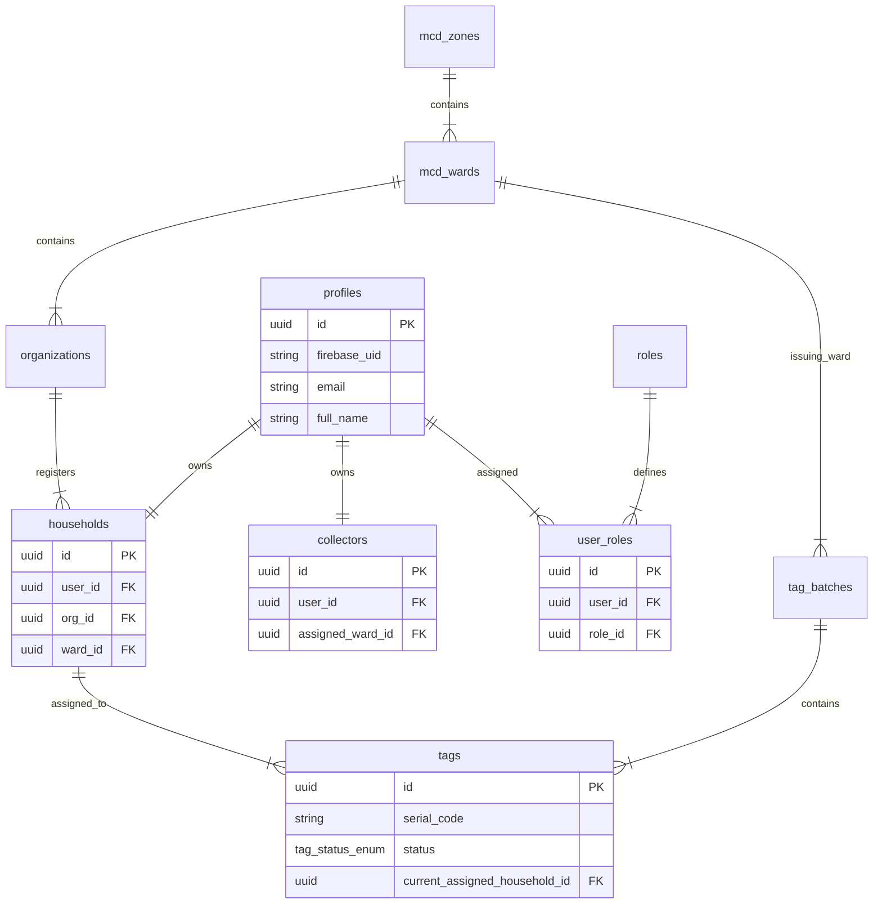
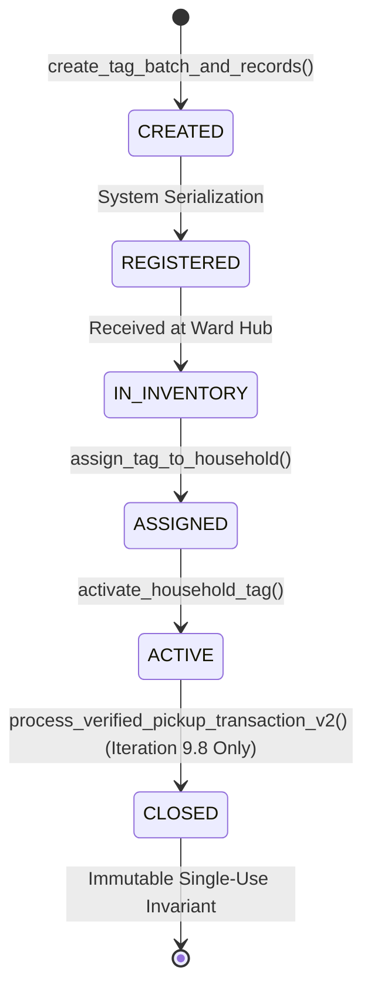

# ITERATION 9.7 — SAFE LIVE E2E FIXTURE PROVISIONING PLAN

## Executive Summary
This document establishes the database schema audit, fixture dependency graph, and provisioning plan for NirmalTag Iteration 9.7. It defines the exact PostgreSQL schema relationships and lifecycle transitions required to establish a safe, repeatable test environment for authenticated Collector E2E acceptance without compromising production Row-Level Security (RLS) or server authorization.

---

## A. Database Schema Dependency Graph & Foreign Keys

### Relational Schema Foreign Key Invariants:
1. **Collector User Fixture**:
   - `auth.users` (Firebase User UID string)
   - `public.profiles` (`id` = `auth.users.id`, `firebase_uid`, `email`)
   - `public.roles` (`name` = `'COLLECTOR'::user_role_enum`)
   - `public.user_roles` (`user_id` = `profiles.id`, `role_id` = `roles.id`)
   - `public.collectors` (`user_id` = `profiles.id`, `assigned_ward_id` = `mcd_wards.id`)

2. **Household Resident Fixture**:
   - `public.mcd_zones` $\to$ `public.mcd_wards` (e.g. Ward 42 Green Park)
   - `public.organizations` (`org_type` = `'RWA'`, `ward_id` = `mcd_wards.id`)
   - `public.profiles` (Household resident user profile)
   - `public.user_roles` (`role_id` for `'HOUSEHOLD'`)
   - `public.households` (`id` PK, `user_id`, `org_id`, `ward_id`)

3. **Tag Supply Chain & Lifecycle Fixture**:
   - `public.waste_categories` (`code` = `'SANITARY'`, `credit_reward_points` = 10, `collector_incentive_inr` = 2.00)
   - `public.tag_batches` (`created_by` = Officer Profile ID, `ward_id` = `mcd_wards.id`)
   - `public.tags` (`serial_code` generated via sequence `tag_serial_seq`)

---

## B. Fixture Provisioning Status Matrix

| Component / Step | Status | Governance / Requirements |
| :--- | :--- | :--- |
| **A. Database schema map** | **PASS** | Schema dependencies fully mapped from PostgreSQL migrations `20261003000001` through `20261003000008`. |
| **B. Firebase test account** | **BLOCKED** | `BLOCKED — FIREBASE TEST ACCOUNT CREATION REQUIRES AUTHORIZED FIREBASE ADMIN ACCESS`. Creating Firebase auth users programmatically requires Firebase Admin SDK credentials. |
| **C. Firebase UID → COLLECTOR role** | **BLOCKED** | Requires an authenticated Firebase UID linked to `profiles` and `user_roles` with `role = 'COLLECTOR'`. |
| **D. Test household status** | **BLOCKED** | Requires linking a test profile to a dedicated household record (`E2E_TEST_HOUSEHOLD`) in `public.households`. |
| **E. Test tag status** | **BLOCKED** | `BLOCKED — SAFE ACTIVE TEST TAG REQUIRED`. Provisioning an active tag requires executing authoritative lifecycle transitions: `CREATED` $\to$ `REGISTERED` $\to$ `IN_INVENTORY` $\to$ `ASSIGNED` $\to$ `ACTIVE`. |
| **F. Tag lifecycle used** | **PASS** | Uses authoritative RPCs: `create_tag_batch_and_records` $\to$ `assign_tag_to_household` $\to$ `activate_household_tag`. No direct DB status overrides. |
| **G. Reward policy status** | **PASS** | Derived server-side from `waste_categories` (`credit_reward_points` = 10, `collector_incentive_inr` = 2.00). Zero hardcoded client values. |
| **H. Fixture isolation status** | **PASS** | Every test fixture uses explicit naming prefixes (`E2E_TEST_...`, `NT-SAN-2026-TEST...`) to ensure isolation from production data. |
| **I. Cleanup strategy** | **PASS** | Since `CLOSED` tags are single-use immutable state, each E2E test run requires a freshly provisioned tag serial code from `tag_serial_seq`. |
| **J. Camera environment status** | **BLOCKED** | `CAMERA ENVIRONMENT BLOCKED`. Headless `emulator-5554` requires Virtual Camera image injection or physical device test setup. |
| **K. Security scan** | **PASS** | `git grep "eyJ"` clean (0 matches in source); zero `service_role` keys exposed in repository. |
| **L. Remaining blockers** | **BLOCKED** | Authorized Firebase Admin account provisioning and live database test fixture execution required. |

---

## Authoritative Tag Lifecycle State Machine

> [!CAUTION]
> **No Pickup Transaction Execution**: In strict compliance with Iteration 9.7 rules, `process_verified_pickup_transaction_v2` was **NOT** called, no credit points were awarded, and no tag was transitioned to `CLOSED`.

---

## Fixture Isolation & Cleanup Strategy

1. **Isolation**:
   - Test Organization: `E2E_TEST_RWA_ORG`
   - Test Household: `E2E_TEST_HOUSEHOLD_01`
   - Test Tag Serial: Next serial from sequence `tag_serial_seq` (e.g. `NT-SAN-2026-100001`)
2. **Cleanup & Repeatability**:
   - Because `CLOSED` tags are permanently immutable, test tag execution is **single-use**.
   - Subsequent E2E test runs will execute `create_tag_batch_and_records` to acquire fresh serial numbers automatically without modifying past closed transactions.

---
*Generated for NirmalTag Iteration 9.7 Fixture Plan.*
