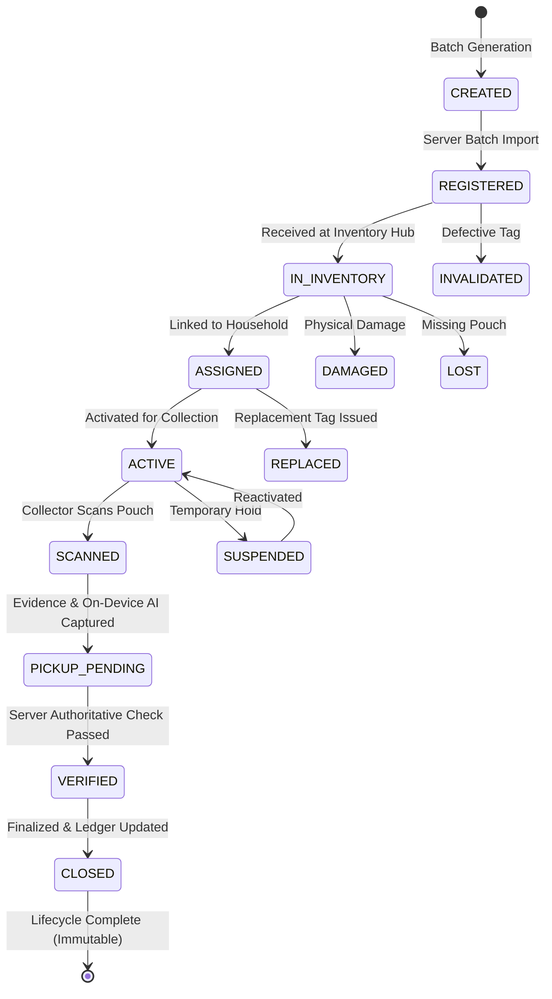

# NIRMALTAG — Tag Lifecycle State Machine & Supply Chain Specification

## 1. Single-Use Tag Concept

NirmalTag physical pouches carry tamper-evident QR code tags. Each tag represents **one single collection cycle**. Once a collection event is authoritatively verified and closed, the tag state transitions to `CLOSED` and **CAN NEVER** be reactivated or reused.

---

## 2. State Transition Invariants

| State | Allowed Next States | Description | Trigger |
| :--- | :--- | :--- | :--- |
| `CREATED` | `REGISTERED` | Identifiers generated in batch | Tag Officer batch import |
| `REGISTERED` | `IN_INVENTORY`, `INVALIDATED` | Batch verified and received into inventory | Inventory Officer inspection |
| `IN_INVENTORY` | `ASSIGNED`, `DAMAGED`, `LOST` | Physical tag handed to household or designated hub | Officer distribution |
| `ASSIGNED` | `ACTIVE`, `REPLACED` | Tag bound to household address/profile | Household/Officer activation |
| `ACTIVE` | `SCANNED`, `SUSPENDED` | Ready on doorstep for pickup | Collector QR scan |
| `SCANNED` | `PICKUP_PENDING` | Photo & on-device AI classification complete | Collector evidence submission |
| `PICKUP_PENDING` | `VERIFIED`, `REVIEW_REQUIRED`, `REJECTED` | Server checks lifecycle state, duplicate rules | Server validation API |
| `VERIFIED` | `CLOSED` | Pickup finalized, credits & incentives written to ledger | Transactional commit |
| `CLOSED` | None (Terminal) | Immutable complete lifecycle | Database invariant constraint |

---

## 3. QR Identifier Structure

A physical QR code contains a clean, unprivileged identifier:

Example: `NMT-2026-89A4B-000492`

**SECURITY NOTICE**: QR payload MUST NOT contain:
- Household name, address, phone number, email
- Firebase UID or JWT tokens
- Account credit balances
- Secret cryptographic keys

The QR token is an **Identifier**, NOT a secret key. Authoritative validation occurs on the server using collector credentials, current tag lifecycle state, timestamp bounds, and evidence hashes.
